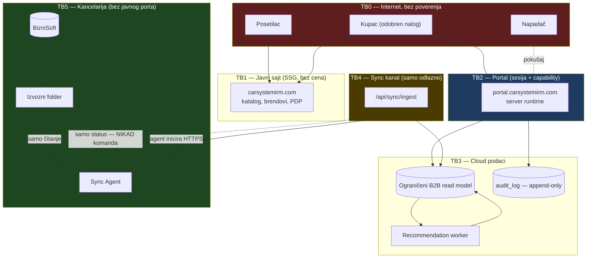
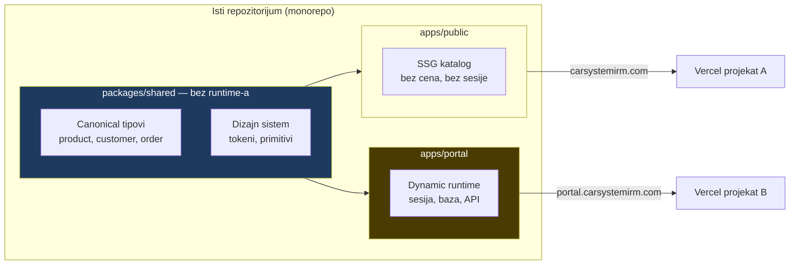
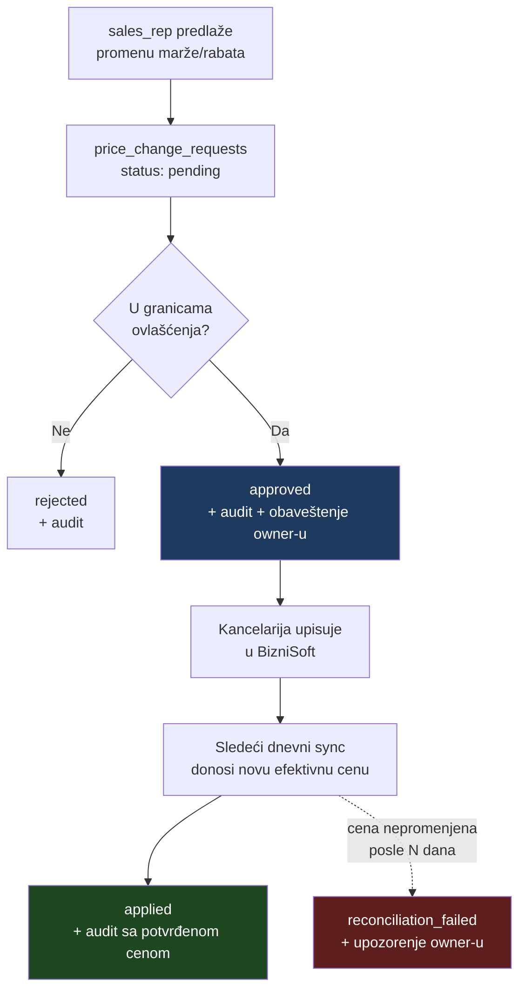

# 01 — Ciljna arhitektura

Oznake: 🟢 potvrđeno u kodu · 🔵 predloženo · 🔴 blokirano · 🟡 odluka vlasnika

---

## Pregled granica poverenja

**Najstroža granica je TB3→TB5.** Cloud nikada ne otvara vezu ka kancelariji i nikada ne šalje sadržaj koji agent izvršava.

---

## AD-1 — Razdvajanje javnog sajta i portala 🔵

### Zatečeno stanje 🟢

Premisa da javni sajt koristi `output: "export"` **ne važi** (vidi `00-current-state-audit.md`, §6). Sajt je SSG uz pun server runtime; middleware, route handleri i baza već rade u produkciji. Portal je danas u **istoj** aplikaciji, na `/portal`.

### Odluka: razdvojiti — ali zbog bezbednosti, ne zbog hostinga

Razdvajanje **nije tehnički nužno**. Opravdano je jednim razlogom: **smanjenjem površine napada oko podataka koje kupac ne sme videti.**

Danas jedan Next runtime opslužuje i javni katalog i portal. Ranjivost u bilo kom delu javnog sloja deli proces, promenljive okruženja i konekcioni pool sa portalom.

### Ciljna struktura 🔵

**Deli se:** canonical tipovi, dizajn sistem, čista logika bez I/O.
**Ne deli se:** `AUTH_SECRET`, `DATABASE_URL`, sesijski cookie, konekcioni pool, middleware.

### Cookie granica 🔵

| Postavka | Vrednost | Razlog |
|---|---|---|
| Domen | **host-only** za `portal.carsystemirm.com` | Bez `Domain=` atributa cookie ne curi na `carsystemirm.com` ni na druge poddomene |
| `HttpOnly` | `true` | JS ga ne čita |
| `Secure` | `true` | Samo HTTPS |
| `SameSite` | `Lax` | Dovoljno za form-post prijavu; `Strict` bi pokvario povratak sa spoljnog linka |
| Prefiks imena | `__Host-` | Pretraživač odbija cookie sa `Domain=` ili bez `Secure` |

Danas se ovo **ne postavlja eksplicitno** — oslanja se na NextAuth default (`auth.config.ts`). 🟢

### Plan migracije — fajlovi koji se pomeraju 🔵

| Iz | U | Rizik |
|---|---|---|
| `app/portal/**` | `apps/portal/app/**` | nizak — grana je samostalna |
| `app/prijava/`, `app/api/auth/`, `app/api/portal/` | `apps/portal/app/**` | nizak |
| `auth.ts`, `auth.config.ts` | `apps/portal/` | nizak |
| `db/**`, `drizzle.config.ts` | `apps/portal/db/**` | nizak — ništa javno ga ne uvozi |
| `lib/authz/**`, `lib/audit/**`, `lib/sales/**`, `lib/import/**`, `lib/export/**` | `apps/portal/lib/**` | nizak |
| `lib/commerce/`, `lib/cart/`, `components/cart/` | `apps/portal/**` | **srednji** — nekomitovano, vidi rizik 1 |
| `middleware.ts` | **deli se na dva** | **visok** — vidi rizik 2 |
| `lib/carsystem-data.ts`, `lib/products.ts`, `lib/product-families.ts`, `types/product*.ts` | `packages/shared/` | **visok** — vidi rizik 3 |
| `app/globals.css`, dizajn tokeni, `components/product/**` | `packages/shared/` + `apps/public` | **visok** — vidi rizik 4 |

### Rizici razdvajanja 🔵

1. **Nekomitovan rad.** 108 stavki u radnom stablu, uključujući ceo product-variant sloj i korpu. Razdvajanje pre commita znači gubitak pri prvom čišćenju. **Blokira migraciju dok se ne commituje.**
2. **`middleware.ts` radi četiri posla** (auth redirect, `MAINTENANCE_MODE`, site-access cookie, kanonski host). Deljenje na dva middleware-a mora sačuvati sva četiri; propust u maintenance grani otvara javni sajt pre vremena.
3. **`lib/carsystem-data.ts` je ~2.800 linija** i uvoze ga i javne i portal rute. Izdvajanje u `packages/shared` dodiruje desetine fajlova.
4. **Vizuelni sloj je aktivno u radu.** Baslac/SATA/karuseli i tek završeni `ProductVariantProvider`. Premeštanje bi se sudarilo sa tim radom.

### Kada razdvojiti 🟡

Preporuka: **ne pre nego što nastupi bar jedan uslov** —

- prvi kupčev nalog dobije pristup pravim cenama (granica postaje ozbiljna), **ili**
- javni sajt izađe iz `MAINTENANCE_MODE` i primi stvaran saobraćaj, **ili**
- uvede se ingest endpoint koji prima podatke izvan pretraživača.

**Do tada** primeniti jeftine mere u postojećoj aplikaciji:

| Mera | Fajl |
|---|---|
| Eksplicitne `__Host-` cookie postavke | `auth.config.ts` |
| CSP + HSTS (danas samo `X-Robots-Tag`) | `next.config.ts:headers()` |
| Host-scoping: `/portal/*` vraća 404 kad `Host` nije portal host | `middleware.ts` |
| Rate limiting po IP-u na `/api/auth/*` | `middleware.ts` |

> Ovo je preporuka, ne konačna odluka. Ako se traži razdvajanje odmah, izvodljivo je — ali tada prva faza postaje refaktor infrastrukture, a ne isporuka B2B funkcije, uz sva četiri navedena rizika. 🟡

---

## AD-2 — Kupac je nova granica poverenja, ne peta uloga 🔵

**Najvažnija odluka u ovom dokumentu.** Detaljno u `02-auth-roles-tenancy.md`.

Sažeto: `users.role` ostaje **interni** enum. Kupčev nalog se uvodi kao **odvojen identitet** (`customer_users`) koji fizički nosi svoj `customer_id`. Razlog: `resolveCapabilities(role, packages)` vraća skup sposobnosti koji **ne poznaje pojam „čiji"** — dodavanje `customer` u taj skup znači da svaka postojeća provera mora dodatno pitati „a koji kupac?", što je tačno oblik greške koji proizvodi cross-customer IDOR.

---

## AD-3 — BizniSoft je vlasnik konačne cene 🔵

Portal **nikada** ne računa cenu. Čuva se **preuzeta efektivna cena** po paru (kupac, artikal).

| Tabela | Uloga | Prikazuje se kupcu? |
|---|---|---|
| `customer_effective_prices` | Preuzeto iz BizniSofta. **Jedini izvor cene u UI-ju** | **Da** |
| `price_change_requests` | Predlog iz portala, sa workflow-om | Ne |
| `price_rules` *(opciono)* | Opis pravila radi objašnjenja | Samo interno, uz oznaku „procena" |

**Zaštita od raskoraka:** ako se cena izračunata iz pravila razlikuje od preuzete, prikazuje se **preuzeta**, a razlika ide u audit kao upozorenje. Nikada obrnuto.

### Tok odobrenja promene cene 🔵

**Ključno: `approved` ≠ `applied`.** Zahtev postaje `applied` tek kada se nova efektivna cena vrati kroz sync. Stanje `reconciliation_failed` hvata tihi otkaz — odobreno u portalu, nikad upisano u BizniSoft.

🔴 **Blokirano:** da li se upis u BizniSoft radi ručno ili postoji pisiva veza — nepoznato. Dijagram pretpostavlja **ručni upis** kao najbezbedniju polaznu tačku. Vidi `09-owner-decisions-and-blockers.md`, P5.

---

## AD-4 — Cloud baza je ograničeni read model 🔵

| Ide u cloud | Ne ide u cloud |
|---|---|
| Kupci: naziv, PIB, grad, adresa isporuke | Finansijski karton, saldo, blokade |
| Artikli: šifra, naziv, grupa, brend, JM | Nabavne cene, marže dobavljača |
| Efektivne cene: (kupac, artikal) → cena | Cenovna politika, kalkulacije |
| Lager: dostupno / nedostupno / količina | Lokacije, serije, rezervacije |
| Istorija prodaje: šta i kada, po kupcu | Kompletna knjigovodstvena evidencija |

Cloud baza **nije kopija BizniSofta**. Kompromitovana cloud baza ne sme dati uvid u celu firmu.

🟡 Da li „dostupno/nedostupno" umesto tačne količine zadovoljava poslovnu potrebu — odluka vlasnika (P8).

---

## AD-5 — Audit se proširuje, ne gradi iznova 🟢

`db/schema/system.ts:auditLog` + `db/migrations/0001_audit_log_append_only.sql` već daju:

- append-only **sprovedeno okidačima u bazi** (`RAISE EXCEPTION … ERRCODE 'restrict_violation'`), ne samo u aplikaciji
- `actorLabel` — ime i uloga u trenutku radnje, čitljivo i posle brisanja korisnika
- `valueBefore` / `valueAfter` kao `jsonb`, `reason`, `correlationId`
- indekse po entitetu, vremenu i akteru

**Ovo pokriva ceo zahtev za audit promene marže.** Treba samo dodati nove `action` vrednosti u `lib/audit/record.ts:AUDIT_ACTIONS` i obavezno popunjavati `reason`.

🔵 Jedina dopuna na nivou baze: **oduzeti `UPDATE`/`DELETE`/`TRUNCATE` privilegije aplikativnoj ulozi**. Okidač štiti od greške u kodu, ne od naloga koji sme `DROP TRIGGER`.

---

## AD-6 — Auth se dopunjuje, ne piše iznova 🔵

NextAuth v5 je već tu i dobro postavljen (vidi `00`, §3). Ne dirati odluku da uloga i dozvole **nisu** u JWT-u.

Dodati, po prioritetu:

| # | Šta | Blokira produkciju? |
|---|---|---|
| 1 | **MFA (TOTP) za sve interne naloge** | **Da** |
| 2 | **Rate limiting po IP-u** na `/api/auth/*` | **Da** |
| 3 | Eksplicitne `__Host-` cookie postavke | Da |
| 4 | Opoziv sesije (`session_version` u `users`) | Ne, ali visok prioritet |
| 5 | CSP + HSTS | Ne |
| 6 | Invite tok + obavezna promena lozinke pri prvoj prijavi | Za kupce da |

---

## AD-7 — Sync: agent gura, cloud nikad ne vuče 🔵

Detaljno u `04-sync-agent-contract.md`. Nepregovarljiva pravila:

1. Smer je **uvek** kancelarija → cloud.
2. Odgovor servera je **podatak o statusu**, nikad uputstvo koje agent izvršava.
3. Agent ima **read-only** na izvozni folder, pisanje samo u svoj staging.
4. Agent radi pod **namenskim Windows nalogom bez admin prava**.
5. Nijedan port se ne otvara ka internetu. Bez port forwardinga, RDP-a, SMB-a, tunela.
6. Import **nikada ne izvršava sadržaj fajla**.
7. Prihvataju se samo očekivani formati sa poznatim imenima. Bez ZIP-a, EXE-a, skripti.

---

## Zbirni pregled odluka

| # | Odluka | Status |
|---|---|---|
| AD-1 | Razdvajanje public/portal — zbog bezbednosti, uz jasan okidač | 🔵 / 🟡 |
| AD-2 | Kupac = odvojen identitet, ne peta uloga | 🔵 |
| AD-3 | BizniSoft vlasnik cene; `approved` ≠ `applied` | 🔵 |
| AD-4 | Cloud je ograničeni read model | 🔵 / 🟡 |
| AD-5 | Postojeći audit se proširuje | 🟢 osnova, 🔵 dopuna |
| AD-6 | NextAuth se dopunjuje (MFA, rate limit, cookies) | 🔵 |
| AD-7 | Agent gura; cloud nikad ne vuče | 🔵 |

**Nijedna odluka nije sprovedena u kodu.** Ovo je predlog za odobrenje.
