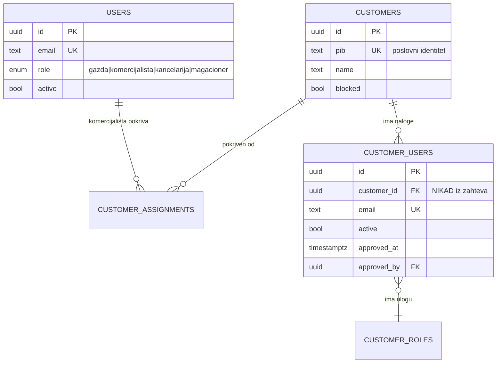
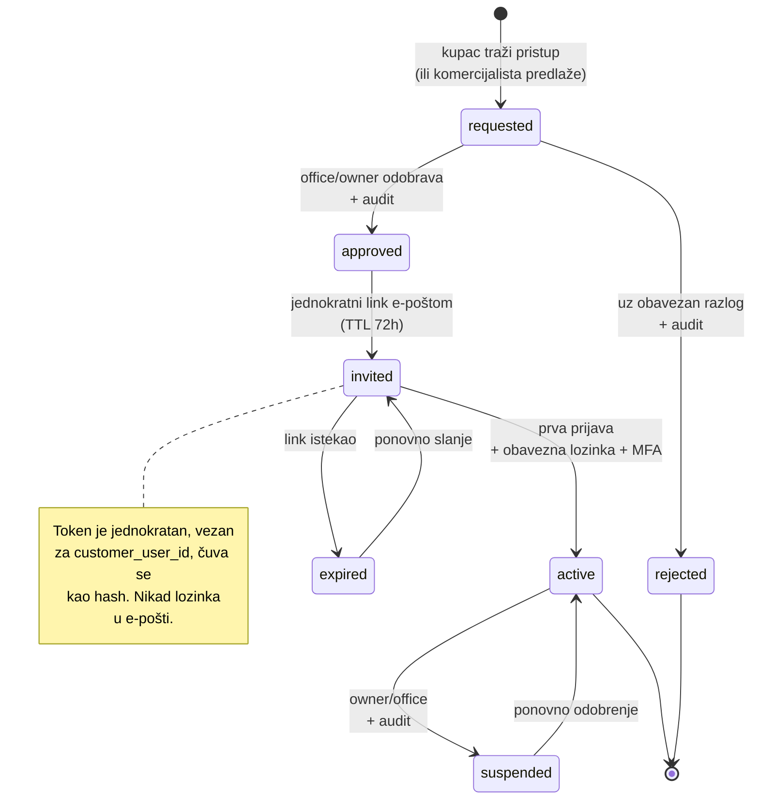

# 02 — Autentifikacija, uloge i tenant izolacija

Oznake: 🟢 potvrđeno u kodu · 🔵 predloženo · 🔴 blokirano · 🟡 odluka vlasnika

---

## 1. Zatečeni model 🟢

### Uloge

`db/schema/users.ts:userRole` — **tačno četiri, sve interne**:

```
gazda | komercijalista | kancelarija | magacioner
```

Komentar u kodu izričito zabranjuje dodavanje uloge „Menadžer": dublji pristup se dodeljuje **paketom dozvola**, ne novom ulogom.

### Dvoslojni model

```
capability = ROLE_BASE[role] ∪ ⋃ PACKAGE_GRANTS[paket]
```

Osam paketa (`lib/authz/permissions.mjs:PERMISSION_PACKAGES`): `analitika`, `otprema`, `nabavka_predlog`, `porucivanje`, `limiti`, `korisnici`, `pragovi`, `zatvaranje`.

**Ovo je dobar model i treba ga zadržati.** Rute se vezuju za sposobnosti (`ROUTE_CAPABILITY`), nikad za ulogu, pa dodavanje paketa ne traži izmenu provera.

### Serverska kapija 🟢

| Funkcija | Fajl | Ponašanje |
|---|---|---|
| `getPortalUser()` | `lib/authz/session.ts` | čita `auth()` → `loadPortalUser(id)` iz **baze** |
| `requireUser(callbackPath?)` | isto | `redirect()` na prijavu |
| `requireCapability(cap, path?)` | isto | `forbidden()` → **pravi 403** (`experimental.authInterrupts`) |
| `requireCustomerAccess(user, id)` | isto | `forbidden()` ako kupac nije u opsegu |
| `requireApiCapability(cap)` | isto | baca `ApiAuthError` → 401/403 JSON |

**Pokrivenost:** 25 poziva `requireCapability()` u `app/`. Provereno nad svim `app/portal/**/page.tsx` — **nijedna ruta nije bez kapije** (svaka ima `requireCapability`, `requireUser` ili je `redirect()`).

### Zašto dozvole nisu u tokenu 🟢

`auth.config.ts:session` nosi komentar:

> „U tokenu stoji isključivo identitet. Uloga i dozvole se namerno ne prenose ovuda — čitaju se iz baze pri svakom zahtevu, pa oduzimanje dozvole deluje odmah umesto da čeka istek tokena."

**Ovo je najbolja postojeća bezbednosna odluka u repozitorijumu.** Mora se sačuvati pri svakoj izmeni.

---

## 2. Mapiranje trenutnog na ciljni model 🔵

> Ovo je **mapa, ne implementacija**. U ovoj fazi se ne dodaju uloge u kod.

| Ciljna uloga | Trenutni ekvivalent | Stanje | Napomena |
|---|---|---|---|
| `owner` | `gazda` | 🟢 postoji | Puna pokrivenost; `ROLE_BASE.gazda` ima sve sposobnosti |
| `sales_manager` | **nema** | 🔴 nedostaje | Najbliže: `komercijalista` + paket `analitika` (daje `customers:view_all`). Ali nema upravljanje dodelama ni predlog cena |
| `sales_rep` | `komercijalista` | 🟢 postoji | Vidi samo dodeljene (`customer_assignments`). Nedostaje: porudžbina u ime kupca, predlog marže |
| `office` | `kancelarija` | 🟢 postoji | Nedostaje: pregled i potvrda kupčevih zahteva |
| `warehouse` | `magacioner` | 🟢 postoji | `ROLE_BASE.magacioner` = `view:otprema`, `view:adresnice`, `view:bex`. **Ekran magacina ne postoji** — sve tri rute su `PhaseNotice` |
| `customer` | **ne postoji** | 🔴 nedostaje | Nema ni uloge, ni tabele, ni veze `customers` ↔ `users` |

### Sposobnosti koje nedostaju za ciljni model 🔵

| Nova sposobnost | Nosilac | Zašto |
|---|---|---|
| `cart:use` | `customer`, `sales_rep` | Danas kapija korpe koristi `orders:create` — pogrešna semantika |
| `customer_orders:submit` | `customer`, `sales_rep` | Slanje zahteva |
| `customer_orders:review` | `office` | Pregled i ispravka |
| `customer_orders:confirm` | `office`, `owner` | Potvrda |
| `warehouse:prepare` | `warehouse` | Magacinski ekran |
| `prices:propose` | `sales_rep`, `sales_manager` | Predlog marže/rabata |
| `prices:approve` | `owner`, `sales_manager` (do praga) | Odobrenje |
| `prices:view_margin` | `owner`, `sales_manager` | Vidljivost marže |
| `assignments:manage` | `sales_manager`, `owner` | Dodela kupaca komercijalistima |

**Napomena:** `permissions/portal-permissions.ts` (legacy, mrtav) već sadrži `prices:propose`, `prices:manage`, `prices:view_margin`, `approvals:decide`. Imena su upotrebljiva; model uloga uz njih (`owner`/`sales`/`office`) nije. 🟢

---

## 3. Kupac kao odvojen identitet 🔵

### Problem sa petom vrednošću u enum-u

`resolveCapabilities(role, packages)` vraća **skup sposobnosti bez pojma vlasništva**. Sposobnost `view:kupci` znači „sme da vidi ekran kupaca" — ne „sme da vidi *svog* kupca".

Ako se `customer` doda u isti enum, svaka postojeća provera oblika `can(user, "…")` mora dodatno pitati „a koji kupac?". Zaboravljena dopuna na **jednoj** ruti = curenje cena konkurentu.

### Predložena struktura 🔵

```
users            → INTERNI nalozi (gazda, komercijalista, kancelarija, magacioner)
customer_users   → EKSTERNI nalozi, svaki vezan za tačno jedan customer_id
```



### Struktura je garancija, ne konvencija

Kupčev nalog **fizički nosi** svoj `customer_id`. Nijedan upit ga ne može izgubiti jer ne postoji putanja u kojoj se on uzima odnekud drugde.

### Jedini ulaz u kupčeve podatke 🔵

```ts
// apps/portal/lib/authz/customer-session.ts  [PREDLOG]
export async function requireCustomerSession(): Promise<{
  userId: string;
  customerId: string;   // iz baze, po session.user.id — NIKAD iz URL-a ni body-ja
  capabilities: Set<string>;
}>
```

**Pravilo bez izuzetka:** svaki upit u kupčevoj putanji prima `customer_id` iz ovog helpera. Nijedan handler ne sme čitati `customerId` iz `searchParams`, `params` ni tela zahteva.

Presedan postoji: `lib/authz/session.ts:requireCustomerAccess` + `lib/authz/scope.mjs:canAccessCustomer` rade isto za interne uloge, sa 35 testova. 🟢

---

## 4. Tenant izolacija — zatečeno i ciljno

### Zatečeno 🟢

| Kontrola | Fajl | Ocena |
|---|---|---|
| Opseg **u SQL-u**, ne posle učitavanja | `lib/sales/queries.ts:loadSalesLines` → `inArray(invoices.customerId, scope)` | dobro |
| Provera pristupa kupcu | `lib/authz/session.ts:requireCustomerAccess` | dobro, ali **na jednoj ruti** |
| Filtriranje redova | `lib/authz/scope.mjs` | dobro |
| Izvoz koristi isti upit kao ekran | `app/api/portal/izvoz/route.ts` | dobro |

**Slabost:** `requireCustomerAccess` se poziva **samo iz `app/portal/kupci/[id]/page.tsx:21`**. Ništa strukturno ne prisiljava buduće `[id]` rute da ga zovu. Danas nije problem (nema eksternih korisnika); sutra jeste.

### Ciljno 🔵

Tri sloja, svaki nezavisan:

1. **Identitet** — `customer_id` iz sesije, nikad iz zahteva
2. **Upit** — opseg u `WHERE`, ne u filtriranju posle učitavanja
3. **Test** — **IDOR test po svakoj kupčevoj ruti**, ne uzorak

> **Nepregovarljivo pravilo:** nijedan PR koji dodaje kupčevu rutu ne prolazi bez pripadajućeg IDOR testa. Ručna provera nije dovoljna — vidi `07-threat-model.md`, T4.

---

## 5. Tok odobrenja naloga 🔵

Zahtev kaže „ručno odobreni nalozi". Danas ne postoji **nikakav** invite/approval tok. 🟢



🟡 **Odluka vlasnika:** ko otvara nalog (owner? office? sales_rep predlaže?), i može li jedna firma imati **više naloga** (vlasnik + nabavka). Drugo pitanje menja `customer_users` iz 1:1 u 1:N — struktura iznad već podržava 1:N.

**Predlog dok nema odgovora:** office otvara, kupac dobija poziv e-poštom, jedna firma sme više naloga.

---

## 6. Bezbednosni nedostaci — zatečeno stanje 🟢

| Nedostatak | Stanje posle Faze 1A | Ozbiljnost |
|---|---|---|
| **Nema MFA** | 🟡 jezgro implementirano (TOTP, šifrovanje, recovery), **ali nije zakačeno na prijavu** | **Blokira produkciju** |
| **Nema rate limitinga po IP-u** | 🟡 politika i servis implementirani, **ali ih auth tok ne poziva** | **Blokira produkciju** |
| **Nema reseta lozinke** | 🔴 i dalje nedostaje — Faza 1B | Visoka |
| **Nema invite toka** | 🔴 i dalje nedostaje — Faza 2 | Visoka za kupce |
| **Nema opoziva sesije** | ✅ **rešeno** — `users.session_version` + provera u `lib/authz/session.ts:getPortalUser` | — |
| **Cookie postavke nisu eksplicitne** | ✅ **rešeno** — `lib/auth/cookie-policy.mjs`, `__Host-` u produkciji, host-only | — |
| **Nema CSP ni HSTS** | ✅ **delimično** — `lib/security/http-headers.mjs`; enforced samo bezbedne direktive, puna politika u Report-Only | Preostaje uklanjanje `'unsafe-inline'` |
| **Dva modela dozvola** | ✅ **rešeno** — legacy izolovan u `features/portal/LegacyAccessGuard.tsx`, nedostižan iz `app/` | — |
| **`orders:create` dvoznačno** | ✅ **rešeno** — `procurement:order_create` i `customer_orders:create` | — |
| **Timing kanal pri prijavi** | ✅ **rešeno** — `lib/auth/credentials-login.mjs`, jedna provera i za nepostojeći nalog | — |
| **Formula injection u izvozu** | ✅ **rešeno** — `lib/export/spreadsheet-safety.mjs` | — |

---

## 7. Redosled zatvaranja 🔵

| # | Mera | Faza | Stanje |
|---|---|---|---|
| 1 | Eksplicitne `__Host-` cookie postavke | 1A | ✅ |
| 2 | `session_version` → opoziv sesije | 1A | ✅ |
| 3 | Izolovati legacy model dozvola | 1A | ✅ |
| 4 | Razdvojiti `orders:create` | 1A | ✅ |
| 5 | Konstantan put provere lozinke | 1A | ✅ |
| 6 | Zaštita izvoza od formula injectiona | 1A | ✅ |
| 7 | CSP (enforced + Report-Only) i HSTS | 1A | ✅ |
| 8 | **Rate limiting po IP-u na `/api/auth/*`** | **1B** | 🔴 |
| 9 | **MFA (TOTP) za interne naloge** | **1B** | 🔴 |
| 10 | Oduzeti `UPDATE`/`DELETE` nad `audit_log` aplikativnoj ulozi | 1B | 🔴 |
| 11 | Reset lozinke + opoziv pri promeni | 1B | 🔴 |
| 12 | `customer_users` + `requireCustomerSession()` | 2 | 🔴 |
| 13 | Invite/approval tok | 2 | 🔴 |
| 14 | Uklanjanje `'unsafe-inline'` iz CSP | 6 | 🔴 |

### Napomena o dometu TOTP zaštite

TOTP štiti od **ukradene lozinke**, ali **nije otporan na phishing**: korisnik
koji unese kod na lažnu stranu daje napadaču i drugi faktor, jer kod nije vezan
za adresu sajta. Passkeys/WebAuthn to rešavaju vezivanjem za poreklo i ostaju
buduće poboljšanje — van dometa Faze 1B.

> **Tenant izolacija kupca NIJE rešena.** Faza 1A je dirala samo interni auth
> temelj. Kupac kao subjekt i dalje ne postoji — vidi §3 i §4.

Sve je **aditivno** — nijedna stavka ne menja postojeće ponašanje internog portala.
