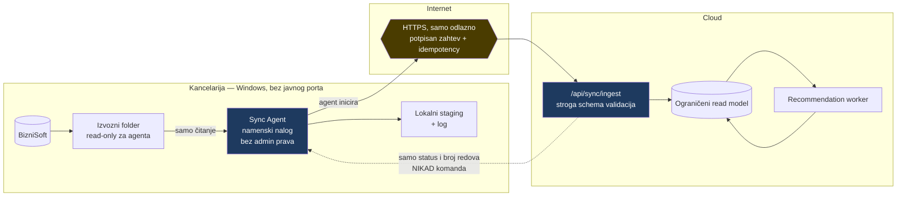
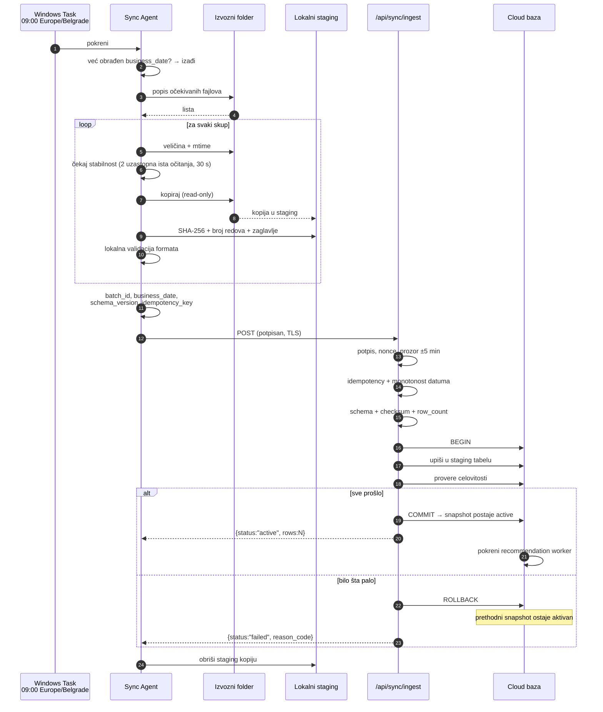
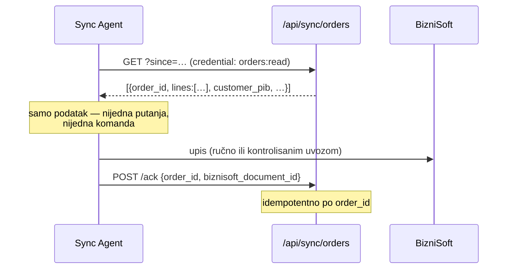

# 04 — Ugovor lokalnog Sync Agenta

> **Stanje: 🔵 u celini predloženo. Ništa od ovoga ne postoji u kodu.** 🟢
>
> `grep INGEST_API_KEY` i `grep FEATURE_FOLDER_CONNECTOR` daju pogotke isključivo
> u `.env.example` i `docs/portal/SETUP.md`. Nema agenta, nema ingest endpointa,
> nema HMAC/mTLS logike. Trenutni uvoz je **ručni upload kroz pretraživač**
> (`features/portal/ImportUpload.tsx` na `/portal/importi`).

---

## 1. Smer i granica



### Sedam nepregovarljivih pravila

1. Smer je **uvek** kancelarija → cloud. Cloud nikada ne otvara vezu ka kancelariji.
2. Odgovor servera je **podatak o statusu**, nikad uputstvo koje agent izvršava.
3. Agent ima **read-only** pristup izvoznom folderu; pisanje samo u svoj staging.
4. Agent radi pod **namenskim Windows nalogom bez administratorskih privilegija**.
5. Nijedan port se ne otvara ka internetu. Bez port forwardinga, RDP-a, SMB-a, tunela.
6. Import **nikada ne izvršava sadržaj fajla** — samo ga parsira kao podatak.
7. Prihvataju se samo očekivani formati sa poznatim imenima. **Bez ZIP-a, EXE-a, skripti, proizvoljnih putanja.**

---

## 2. Dnevni tok



### Provera da fajl više nije u pisanju

Bez OS-specifičnih trikova: agent čita **veličinu i `mtime`** dva puta u razmaku od 30 sekundi. Isti rezultat = fajl je miran. Različit = čeka i pokušava ponovo, najviše N puta.

Dodatno, na Windowsu: pokušaj otvaranja sa `FILE_SHARE_READ` bez `FILE_SHARE_WRITE` — ako drugi proces još piše, otvaranje ne uspeva. To je potvrda, ne zamena za proveru stabilnosti.

---

## 3. Ovojnica batch-a 🔵

```json
{
  "batch_id": "018f3c2a-0000-7000-8000-000000000000",
  "dataset": "customer_effective_prices",
  "schema_version": 1,
  "business_date": "2026-08-24",
  "generated_at": "2026-08-24T09:02:11+02:00",
  "row_count": 412,
  "file_checksum": "sha256:2f0e…",
  "idempotency_key": "sha256:9c41…",
  "agent_id": "office-pc-01"
}
```

| Polje | Pravilo |
|---|---|
| `idempotency_key` | `sha256(dataset ‖ business_date ‖ file_checksum)`. Isti ključ → vraća se **rezultat prvog uvoza**, bez ponovnog uvoza |
| `business_date` | `Europe/Belgrade`. Jedan poslovni dan po skupu |
| `schema_version` | Nepoznata → **odbij batch**, ne pogađaj |
| `row_count` | Neslaganje sa stvarnim brojem → **odbij** |
| `file_checksum` | Neslaganje → **odbij** |
| `agent_id` | Za rate limiting i za trag u auditu |

> **Odbijanje je uvek bezbednije od delimičnog uvoza.** Prethodni snapshot ostaje aktivan i portal radi sa jučerašnjim, tačnim podacima.

### Postojeći presedan 🟢

`db/schema/imports.ts:import_runs` već ima `file_hash` sa `uniqueIndex`, a ponovni pokušaj se beleži kao `preskoceno_duplikat` — da u istoriji ostane trag da je neko pokušao. `lib/import/invoiceImport.ts:114` već radi `db.transaction()`.

**Ovo je proširenje dokazanog obrasca, ne nov izum.**

---

## 4. Autentifikacija agenta 🔵

| Sloj | Mehanizam | Zašto |
|---|---|---|
| Transport | TLS 1.2+ | Osnova |
| Identitet | **mTLS klijentski sertifikat** (poželjno) ili potpisan zahtev | Sam token nije dovoljan |
| Potpis | HMAC-SHA256 nad `agent_id ‖ timestamp ‖ nonce ‖ body_hash` | Integritet + poreklo |
| Sveži zahtev | `timestamp` u prozoru **±5 min** | Ograničava replay |
| Jedinstvenost | `nonce` se pamti do isteka prozora | Sprečava replay unutar prozora |
| Obim | Token **samo za `ingest`** | Ne daje čitanje ničega |
| Rotacija | Podržana bez zastoja; opoziv trenutan | Ukraden token se gasi |
| Skladište | Windows Credential Manager, ne fajl | Ne curi kroz backup |
| Rate limit | Po `agent_id` | Ograničava zloupotrebu |

**Nikad u repozitorijumu.** `.gitignore:34` blokira `.env*`; `.env.example` sadrži samo imena. 🟢

---

## 5. Šta server sme da odgovori ⚠️ najstrože pravilo

Odgovor je **isključivo** ovog oblika:

```json
{
  "status": "active" | "failed" | "skipped_duplicate" | "quarantined",
  "batch_id": "018f3c2a-…",
  "rows_received": 412,
  "rows_imported": 412,
  "warnings": [{ "code": "ROW_COUNT_DROP", "count": 3 }],
  "reason_code": "SCHEMA_VERSION_UNKNOWN"
}
```

### Agent NE SME

1. da izvrši ništa iz odgovora — ni komandu, ni putanju, ni URL, ni SQL;
2. da prihvati polje koje nije u shemi — **nepoznato polje se odbacuje**;
3. da se sam ažurira sa servera;
4. da otvori ijedan port;
5. da prosledi odgovor drugom procesu;
6. da nastavi rad ako odgovor ne odgovara shemi — **zaustavlja se i loguje**.

> Ovo je granica koju nijedan zahtev za „malo udobnosti" ne sme pomeriti.
> Vidi `07-threat-model.md`, T18.

---

## 6. Preuzimanje potvrđenih porudžbina 🔵

Ako agent kasnije preuzima potvrđene porudžbine ka BizniSoftu:

| Pravilo | Obrazloženje |
|---|---|
| **Računar sam inicira** outbound HTTPS polling | Cloud i dalje ne otvara vezu |
| **Odvojen credential i scope** (`orders:read`) | Kompromitovan ingest token ne daje porudžbine |
| **Strogo definisan order JSON** | Ne udaljena komanda |
| Bez skripti, programa i proizvoljnih putanja | — |
| Potvrda prijema zasebnim pozivom, idempotentno po `order_id` | Sprečava dvostruko knjiženje |



🔴 **Blokirano (P5):** ne znamo da li BizniSoft uopšte prima dokument spolja. Ako ne prima, korak `A→BS` je **ručni prepis u kancelariji** — to je prihvatljivo za pilot od 10–20 kupaca i treba ga otvoreno planirati, ne tretirati kao privremenu sramotu.

---

## 7. Strategija po skupovima 🔵

| Skup | Strategija | Zašto |
|---|---|---|
| `customers` | pun snapshot | Mali obim; propuštena izmena opasnija od ponovljenog uvoza |
| `products` | pun snapshot | ~3.500 stavki — trivijalno |
| `effective_prices` | **pun snapshot** | Najosetljivije. Propuštena izmena = pogrešna cena kupcu |
| `inventory` | pun snapshot | Stanje je po prirodi trenutna slika |
| `sales_history` | **inkrement** | Raste bez ograničenja; identitet dokumenta već sprečava duplikate 🟢 |

Snapshot se uvozi **transakciono**. Ako ijedan korak padne, prethodni ostaje aktivan — nikad delimično stanje.

### Verzionisanje snapshota

Snapshot se **ne briše** odmah po zameni. Čuva se najmanje **7 poslovnih dana**, da bi:

- ukraden ili pokvaren batch mogao da se poništi vraćanjem na prethodni dan,
- razlike između dana bile vidljive (audit cena).

---

## 8. Otpornost 🔵

| Situacija | Ponašanje |
|---|---|
| **Računar ugašen u 09:00** | Task se pokreće pri sledećem podizanju. Agent proverava lokalni dnevnik: ako je `business_date` već potvrđen, **izlazi bez rada** |
| **Prekid interneta** | Ponovni pokušaji sa eksponencijalnim odmakom (1, 2, 5, 15, 30 min), najviše do 18:00. Posle toga upozorenje |
| **Server odbio batch** | Staging se **ne briše** do razrešenja; razlog u lokalnom logu i na `/portal/importi` |
| **Fajl nedostaje** | Skup se preskače, ostali se šalju. Nedostatak se prijavljuje — **ne pravi se prazan snapshot** |
| **Pad broja redova > 20%** | Batch u **karantin**, ne aktivira se, vlasnik obavešten |
| **Sync nije stigao do 10:00** | Upozorenje vlasniku/adminu; portal prikazuje starost podataka |

### Šta vlasnik vidi 🔵

Proširenje postojećeg `/portal/importi` (koji već prikazuje `import_runs`) 🟢:

- poslednji uspešan sync po skupu, sa `business_date` i vremenom;
- broj učitanih redova i odstupanje od prethodnog dana;
- upozorenja i greške, sa šifrom razloga;
- starost podataka na svakom ekranu koji ih koristi.

---

## 9. Zaštita ulaza 🔵

| Pretnja | Kontrola |
|---|---|
| Path traversal | Ime fajla mora proći `^[A-Za-z0-9._-]{1,128}$`. Apsolutna putanja se razrešava i mora ostati unutar dozvoljenog korena. **Server ne prima putanje** — samo sadržaj i metapodatke |
| Formula injection | Vrednost koja počinje `=`, `+`, `-`, `@`, TAB, CR čuva se kao tekst; pri izvozu se prefiksuje apostrofom |
| Schema confusion | `schema_version` je obavezan; nepoznata → odbij. Broj i imena kolona se proveravaju pre parsiranja |
| Preveliki fajl | Gornja granica po skupu; prekoračenje = odbijanje pre parsiranja |
| Maliciozan sadržaj | Import **nikad ne izvršava**; sve je tekst dok validacija ne dokaže suprotno |
| Arhive i izvršni fajlovi | Odbijaju se po ekstenziji **i** po magičnim bajtovima |

---

## 10. Windows postavka 🔵

| Stavka | Vrednost |
|---|---|
| Nalog | Namenski, **bez admin prava**, bez interaktivne prijave |
| Prava na izvozni folder | **Read + List**, bez Write i Delete (provereno pokušajem pisanja) |
| Prava na staging | Full, isključivo na svom folderu |
| Raspored | Task Scheduler, 09:00, `Europe/Belgrade`, „Run whether user is logged on or not" |
| Nadoknada | „Run task as soon as possible after a scheduled start is missed" |
| Odlazne veze | Samo HTTPS ka **tačno jednom** hostu |
| Ulazne veze | **Nema** — firewall pravilo blokira |
| Log | Lokalni fajl sa rotacijom; bez tajni, bez poslovnih podataka |

---

## 11. Šta je potrebno pre pisanja agenta 🔴

| # | Uslov | Vidi |
|---|---|---|
| 1 | Stvaran uzorak izvoza (bar kupci + cene) | P1, P2 |
| 2 | Odgovor postoji li izvoz lagera | P3 |
| 3 | Potvrda da se izvoz može zakazati u 09:00 | P6 |
| 4 | Windows verzija i prava na kancelarijskom računaru | P12 |
| 5 | Odgovor kako porudžbina ulazi u BizniSoft | P5 |

**Faza 4a (ingest endpoint) ne čeka ništa od ovoga** — ugovor definišemo mi. Blokirana je samo faza 4b (adapter + agent). Vidi `08-phased-implementation-plan.md`.
