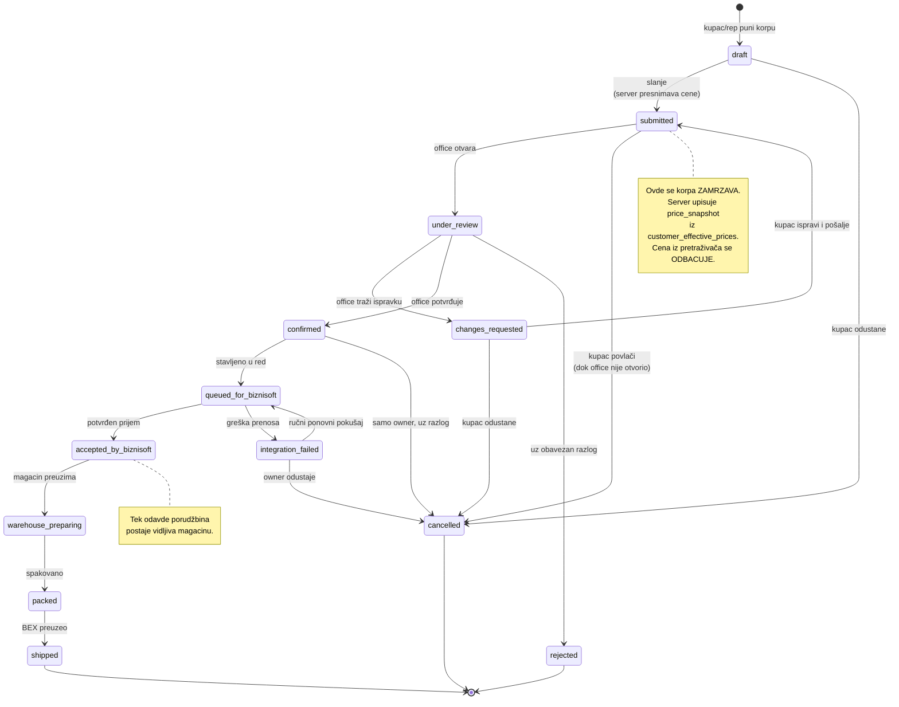
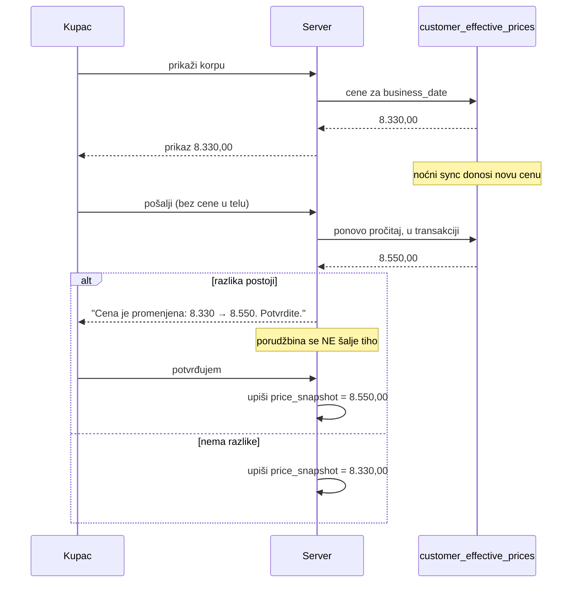

# 05 — Mašina stanja porudžbine

> **Stanje: 🔵 u celini predloženo.** U repozitorijumu ne postoji nijedna tabela
> porudžbina, nijedan status i nijedan serverski prijem korpe. 🟢
> `grep cart|korpa` nad `app/api`, `lib/sales`, `lib/import` → nula pogodaka.
>
> Ne postoji ni stabilan status model koji bi trebalo poštovati, pa se nazivi
> uzimaju iz zadatka. Postojeći enum-i u bazi su na srpskom
> (`document_kind`, `import_status`); **za implementaciju treba odlučiti jezik**
> — vidi §7.

---

## 1. Dijagram

---

## 2. Tabela tranzicija

Kolone: **Ko** (uloga koja sme) · **Preduslovi** · **Audit** · **Idempotency** · **Povratak** · **Šta vidi kupac**

### `draft → submitted`

| | |
|---|---|
| **Ko** | `customer`, `sales_rep` (uz `on_behalf_of`) |
| **Preduslovi** | ≥1 stavka; `customer.blocked = false`; svaka stavka ima važeću efektivnu cenu; nijedan artikal `blocked` |
| **Audit** | `order.submitted` — actor, broj stavki, `business_date` cena |
| **Idempotency** | **`idempotency_key` sa `uniqueIndex`.** Dvostruki klik → ista porudžbina, drugi poziv vraća prvi rezultat |
| **Povratak** | `cancelled` dok office ne otvori |
| **Kupac vidi** | „Zahtev poslat" + broj + spisak sa cenama koje su primenjene |

> **Ovde je jedina tačka u kojoj cena ulazi u sistem.** Server čita `customer_effective_prices` u istoj transakciji i upisuje `price_snapshot`, `price_source`, `price_confirmed_at`, `price_business_date` (M13). Ako se cena promenila u odnosu na prikazanu, **ne šalje se tiho** — kupcu se prikazuje razlika i traži potvrda.

### `submitted → under_review`

| | |
|---|---|
| **Ko** | `office` (`customer_orders:review`) |
| **Preduslovi** | Status `submitted` |
| **Audit** | `order.review_started` |
| **Idempotency** | Ponovno otvaranje ne pravi nov događaj ako je isti akter u istoj sesiji |
| **Povratak** | Nazad na `submitted` nije potrebno — `changes_requested` pokriva slučaj |
| **Kupac vidi** | „U obradi" |

### `under_review → changes_requested`

| | |
|---|---|
| **Ko** | `office` |
| **Preduslovi** | **Obavezan razlog** (`reason`) |
| **Audit** | `order.changes_requested` sa `reason` i spiskom spornih stavki |
| **Idempotency** | Nov zahtev za izmenu = nov događaj |
| **Povratak** | `submitted` (kupac ispravi) ili `cancelled` |
| **Kupac vidi** | Šta tačno treba ispraviti, po stavci |

### `under_review → confirmed`

| | |
|---|---|
| **Ko** | `office` (`customer_orders:confirm`), `owner` |
| **Preduslovi** | Sve stavke imaju `price_snapshot`; nijedna nije nerazrešena |
| **Audit** | `order.confirmed` — ko, kada, ukupan iznos |
| **Idempotency** | Status je već `confirmed` → poziv je no-op, bez novog događaja |
| **Povratak** | `cancelled` — **samo `owner`**, uz razlog |
| **Kupac vidi** | „Potvrđeno" + konačne količine i cene |

> **U pilot fazi ovo je ljudska odluka.** Ništa se ne knjiži automatski.

### `under_review → rejected`

| | |
|---|---|
| **Ko** | `office`, `owner` |
| **Preduslovi** | **Obavezan razlog** |
| **Audit** | `order.rejected` sa `reason` |
| **Idempotency** | Terminalno |
| **Povratak** | **Nema.** Nova porudžbina je nov zapis |
| **Kupac vidi** | Razlog odbijanja |

### `confirmed → queued_for_biznisoft`

| | |
|---|---|
| **Ko** | **Sistem** (ili `office` ručno) |
| **Preduslovi** | `confirmed` |
| **Audit** | `order.queued` |
| **Idempotency** | Ključ je `order_id`. Već u redu → no-op |
| **Povratak** | `cancelled` samo pre preuzimanja |
| **Kupac vidi** | „Potvrđeno" (red je interno stanje) |

### `queued_for_biznisoft → accepted_by_biznisoft`

| | |
|---|---|
| **Ko** | **Sistem**, po `ack` pozivu agenta |
| **Preduslovi** | Agent javio `biznisoft_document_id` |
| **Audit** | `order.accepted_by_biznisoft` sa ID-em dokumenta |
| **Idempotency** | **Ključ `order_id`.** Ponovljeni `ack` sa istim ID-em → no-op; sa **različitim** ID-em → **alarm, ne prihvatanje** |
| **Povratak** | Storniranje se radi u BizniSoftu; portal beleži, ne poništava |
| **Kupac vidi** | „Prihvaćeno" |

> Različit `biznisoft_document_id` za istu porudžbinu znači da je dokument knjižen dvaput. To je incident (T17), ne stanje.

### `queued_for_biznisoft → integration_failed`

| | |
|---|---|
| **Ko** | **Sistem** |
| **Preduslovi** | Greška prenosa ili istek |
| **Audit** | `order.integration_failed` sa šifrom greške |
| **Idempotency** | — |
| **Povratak** | **Ručni** ponovni pokušaj → `queued_for_biznisoft`. **Nikad automatski** |
| **Kupac vidi** | „Potvrđeno" — internu grešku ne prikazujemo kupcu |

> **Bez automatskog ponavljanja.** Neuspeh čijem se uzroku ne zna razlog ne sme se ponavljati u petlji ka poslovnom sistemu.

### `accepted_by_biznisoft → warehouse_preparing`

| | |
|---|---|
| **Ko** | `warehouse` (`warehouse:prepare`) |
| **Preduslovi** | `accepted_by_biznisoft` |
| **Audit** | `order.warehouse_started` |
| **Povratak** | Nazad na `accepted_by_biznisoft` uz razlog |
| **Kupac vidi** | „U pripremi" |

> **Magacin ne vidi `draft`, `submitted`, `under_review` ni `confirmed`.** Prva vidljivost je `accepted_by_biznisoft`.

### `warehouse_preparing → packed → shipped`

| | `packed` | `shipped` |
|---|---|---|
| **Ko** | `warehouse` | `warehouse` |
| **Preduslovi** | Sve stavke obrađene | BEX pošiljka kreirana |
| **Audit** | `order.packed` (broj paketa, masa) | `order.shipped` (broj pošiljke) |
| **Povratak** | Nazad uz razlog | **Nema** |
| **Kupac vidi** | „Spremno za otpremu" | „Otpremljeno" + broj pošiljke |

🔴 `shipped` zavisi od BEX-a, koji **ne postoji u kodu** 🟢. Do tada se status postavlja ručno.

### `* → cancelled`

| | |
|---|---|
| **Ko** | `customer` (do `under_review`), `owner` (posle) |
| **Preduslovi** | **Obavezan razlog** posle `confirmed` |
| **Audit** | `order.cancelled` sa razlogom i prethodnim statusom |
| **Povratak** | **Nema.** Terminalno |
| **Kupac vidi** | „Otkazano" + razlog |

---

## 3. Vidljivost po ulozi

| Status | customer | sales_rep | office | warehouse | owner |
|---|---|---|---|---|---|
| `draft` | ✔ svoj | ✔ svojih kupaca | — | — | ✔ |
| `submitted` | ✔ | ✔ | ✔ | — | ✔ |
| `under_review` | ✔ (kao „u obradi") | ✔ | ✔ | — | ✔ |
| `changes_requested` | ✔ + šta ispraviti | ✔ | ✔ | — | ✔ |
| `confirmed` | ✔ | ✔ | ✔ | — | ✔ |
| `queued_for_biznisoft` | ✔ (kao „potvrđeno") | ✔ | ✔ | — | ✔ |
| `integration_failed` | ✔ (kao „potvrđeno") | — | ✔ | — | ✔ |
| `accepted_by_biznisoft` | ✔ | ✔ | ✔ | **✔** | ✔ |
| `warehouse_preparing` | ✔ | ✔ | ✔ | ✔ | ✔ |
| `packed` | ✔ | ✔ | ✔ | ✔ | ✔ |
| `shipped` | ✔ | ✔ | ✔ | ✔ | ✔ |
| `cancelled` / `rejected` | ✔ + razlog | ✔ | ✔ | — | ✔ |

**Kupac uvek vidi isključivo svoje porudžbine** — `customer_id` iz sesije (`02-auth-roles-tenancy.md`, §3).

---

## 4. Idempotency — zbirno

| Mesto | Ključ | Ponašanje pri ponavljanju |
|---|---|---|
| Slanje | `orders.idempotency_key` (`uniqueIndex`) | Vraća prvu porudžbinu |
| Prenos u BizniSoft | `order_id` | No-op ako je već prenet |
| `ack` od agenta | `order_id` + `biznisoft_document_id` | Isti ID → no-op. Različit → **alarm** |
| Prelaz statusa | `(order_id, to_status)` | Isti prelaz dvaput → jedan događaj |

---

## 5. Šta nikad nije dozvoljeno

1. **Cena iz pretraživača.** Odbacuje se; ako telo zahteva uopšte sadrži polje cene → audit + odbijanje.
2. **Automatsko knjiženje.** `confirmed` je ljudska odluka u pilot fazi.
3. **Automatsko ponavljanje ka BizniSoftu** posle `integration_failed`.
4. **Brisanje porudžbine.** `cancelled`/`rejected` su terminalna stanja; red ostaje.
5. **Prelaz koji preskače stanja.** Svaki prelaz mora biti u dijagramu.
6. **Prelaz bez audita.**
7. **Magacin vidi nepotvrđeno.**

---

## 6. Šta se dešava kad se cena promeni između korpe i slanja

Vidi `07-threat-model.md`, T9.

---

## 7. Otvorena pitanja za implementaciju 🟡

1. **Jezik enum-a.** Postojeći enum-i u bazi su na srpskom (`document_kind`, `import_status`, `user_role`). Statusi iz zadatka su na engleskom. **Predlog: engleski za `order_status`**, jer je to nov domen i imena su već dogovorena; postojeći enum-i se ne diraju. Traži potvrdu.
2. **`sales_manager` u toku porudžbine** — samo pregled, ili sme i da potvrdi? Predlog: pregled + odobrenje cene, bez potvrde porudžbine.
3. **Rok važenja `submitted`** — koliko dugo zahtev može čekati office pre nego što istekne? Predlog: bez isteka u pilotu, uz upozorenje posle 48h.
4. **Delimična potvrda** — sme li office potvrditi deo stavki i odbiti ostatak? Predlog: **ne** u prvoj verziji; koristi se `changes_requested`.
