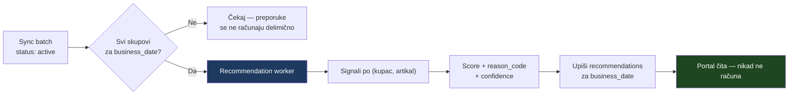

# 06 — Preporuke, verzija 1

> **Stanje (1. septembar 2026): 🟡 V1 je implementiran kao `cadence_v1`.**
> Sekcije 1–10 su NACRT iz avgusta, pisan pre nego što je postojao ijedan uvezen
> dokument. Ono što je stvarno isporučeno je **uže** i opisano je u
> [§11](#11-šta-je-stvarno-isporučeno-kao-v1-cadence_v1) — ta sekcija je
> merodavna. Sekcije 1–10 ostaju kao zapis kako se razmišljalo.
>
> Postoji samo `docs/PRODUCT_RECOMMENDATION_LOGIC.md` — javni blok „Slični
> proizvodi", koji koristi **ručno kurirane** `relatedProductSlugs` i izričito
> kaže: *„Ne postoji automatsko rangiranje, scoring ili cross-brand
> recommendation algoritam."* 🟢 To je **drugi problem** (tehnička srodnost
> proizvoda) od ovog (šta ovaj kupac verovatno treba da naruči).

---

## 1. Načela

1. **Nije generativni AI.** Deterministički izračun nad istorijom kupovine.
2. **Objašnjivo.** Svaka preporuka nosi `reason_code` — šifru, ne slobodan tekst.
3. **Merljivo.** `algorithm_version` uz svaki red; bez toga se ne zna da li je nova verzija bolja.
4. **Unapred izračunato.** Worker računa posle uspešnog importa; portal samo čita.
5. **Nikad ne poručuje sam.** Ni jedna stavka ne ulazi u korpu bez ljudskog klika.
6. **Ćuti kad ne zna.** Bez dovoljno podataka piše „Nedovoljno podataka za pouzdanu preporuku" — ne izmišlja predlog.

Načelo 6 je već ustaljeno u repozitorijumu: `app/portal/nabavka/page.tsx` i `app/portal/zalihe/page.tsx` prikazuju **šta nedostaje** umesto da pogađaju. 🟢

---

## 2. Kada se računa



**Nikad u zahtevu korisnika.** Kupac sa 3.500 artikala i dve godine istorije ne sme čekati izračun.

---

## 3. Signali

| # | Signal | Izvor | Postoji danas? |
|---|---|---|---|
| S1 | Broj prethodnih kupovina artikla | `invoice_lines` | 🟢 tabela postoji, podataka nema |
| S2 | **Medijalni** interval između kupovina | `invoices.issued_on` | 🟢 isto |
| S3 | Dana od poslednje kupovine | isto | 🟢 isto |
| S4 | Uobičajena količina (medijana) | `invoice_lines.quantity` | 🟢 isto |
| S5 | Stabilnost ciklusa (MAD / medijana) | izvedeno iz S2 | 🟢 isto |
| S6 | Sezonalnost | isto, ≥ 2 godine | 🔴 zavisi od dubine istorije (P7) |
| S7 | Artikli koji se poručuju zajedno | `invoice_lines` po fakturi | 🟢 isto |
| S8 | Lager / dostupnost | `inventory_snapshot` | 🔴 **ne postoji** (P3) |
| S9 | Aktivan / blokiran proizvod | `product.active`, `.blocked` | 🔵 polja predložena |
| S10 | Odgovarajuće zamene | mapiranje zamena | 🔴 **ne postoji izvor** |
| S11 | Ručni prioritet komercijaliste | portal | 🔵 nova tabela |

### Medijana, ne prosek

S2 i S4 koriste **medijanu**. Jedna vanredna nabavka (npr. trostruka količina pred sezonu) pomerila bi prosek i proizvela pogrešan predlog za sve naredne mesece. Medijana to ne radi.

### Stabilnost ciklusa (S5)

```
stability = 1 − min(1, MAD(intervali) / median(intervali))
```

`stability → 1` znači da kupac naručuje u pravilnom ritmu i predviđanje je odbranjivo. `stability → 0` znači nasumične nabavke; tada `confidence` pada, a `suggested_quantity` može biti `null`.

---

## 4. Rangiranje

```
due_ratio = dana_od_poslednje_kupovine / medijalni_interval

score = w1·min(1, due_ratio)
      + w2·stability
      + w3·log1p(broj_kupovina) / log1p(max_kupovina)
      + w4·sezonski_faktor
      + w5·zajednicka_kupovina
      − p1·(nedostupno)
      − p2·(neaktivno ili blokirano)
```

| Težina | Značenje | Polazna vrednost 🟡 |
|---|---|---|
| `w1` | Koliko je artikal „dospeo" | 0,40 |
| `w2` | Koliko je ritam pouzdan | 0,20 |
| `w3` | Koliko je artikal ustaljen | 0,20 |
| `w4` | Sezona | 0,10 |
| `w5` | Kupljeno uz nešto drugo | 0,10 |
| `p1` | Kazna za nedostupno | 0,50 |
| `p2` | Kazna za neaktivno/blokirano | **1,00 — potpuno isključenje** |

Težine su **polazne i predmet podešavanja nad stvarnim podacima**. Čuvaju se kao konfiguracija (`system_settings` već postoji za pragove 🟢), ne u kodu.

### Isključenja pre rangiranja

Artikal se **ne preporučuje** ako: `blocked`, `active = false`, nema važeću efektivnu cenu za tog kupca, ili je kupac `blocked`.

---

## 5. Šifre razloga

`reason_code` je enum jer se prikazuje kupcu i meri se uspešnost po razlogu.

| `reason_code` | Kada | Tekst kupcu |
|---|---|---|
| `DUE_BY_CYCLE` | `due_ratio ≥ 1`, `stability ≥ 0,6` | „Obično naručujete na ~{N} dana; prošlo je {M}" |
| `DUE_SOON` | `0,8 ≤ due_ratio < 1` | „Približava se uobičajeni termin nabavke" |
| `FREQUENTLY_BOUGHT` | ≥ 4 kupovine, ritam nestabilan | „Redovno naručujete ovaj artikal" |
| `BOUGHT_TOGETHER` | Uz drugi artikal iz preporuke | „Obično ide uz {artikal}" |
| `SEASONAL` | Sezonski faktor iznad praga | „U ovom periodu ga obično naručujete" |
| `MANUAL_PRIORITY` | Komercijalista označio | „Preporuka vašeg komercijaliste" |
| `REPLACEMENT` | Zamena za nedostupan | „Zamena za {artikal}, trenutno nedostupan" |
| `INSUFFICIENT_DATA` | Premalo podataka | „Nedovoljno podataka za pouzdanu preporuku" |

`INSUFFICIENT_DATA` **nije greška** — to je legitiman, poštovan odgovor.

---

## 6. Pouzdanost

| `confidence` | Uslov | Prikaz |
|---|---|---|
| `high` | ≥ 6 kupovina, `stability ≥ 0,6`, lager poznat | Predlog sa količinom |
| `medium` | ≥ 3 kupovine, ili stabilan ritam bez lagera | Predlog sa količinom, uz napomenu |
| `low` | < 3 kupovine, ili nestabilno | Prikaz **bez** predložene količine |

Kada je `S8` nedostupan (danas — lager ne postoji 🟢), `confidence` je **najviše `medium`**. Sistem tada pošteno kaže da dostupnost nije potvrđena.

---

## 7. Šta preporuka prikazuje

Zahtevani elementi i njihov izvor:

| Element | Izvor | Napomena |
|---|---|---|
| Razlog | `reason_code` → tekst | Nikad slobodan tekst iz baze |
| Pouzdanost | `confidence` | — |
| Predložena količina | `suggested_quantity` | `null` kad se ne može odbraniti |
| **Efektivna cena kupca** | `customer_effective_prices` | **Preuzeta, nikad izračunata** (AD-3) |
| Dostupnost | `inventory_snapshot` + `as_of` | Uz **starost podatka** |
| Link ka artiklu | `product.catalog_slug` | Vodi na postojeći PDP |
| Dodavanje pojedinačno | dugme | Ljudski klik |
| **„Dodaj sve u korpu"** | dugme | **Ljudski klik, uvek** |

### „Dodaj sve u korpu" — pravila

1. Dodaje **samo prikazane** preporuke, ne ceo skup.
2. Otvara korpu da kupac vidi šta je ušlo.
3. **Ne šalje porudžbinu.**
4. Stavka bez `suggested_quantity` ulazi sa količinom 1, jasno označena.
5. Nedostupne stavke se **ne dodaju tiho** — prikazuje se šta je izostavljeno i zašto.

---

## 8. Merenje uspeha 🔵

Bez merenja se ne zna vredi li algoritam.

| Metrika | Definicija |
|---|---|
| Prihvat | Udeo preporuka dodatih u korpu |
| Konverzija | Udeo dodatih koje su i poručene |
| Preciznost količine | Odstupanje `suggested_quantity` od poručene |
| Uspeh po razlogu | Prihvat razložen po `reason_code` |
| Promašena nabavka | Kupac poručio artikal koji nije bio preporučen |

Poslednja metrika je najvrednija — pokazuje šta algoritam **ne vidi**.

---

## 9. Šta blokira verziju 1 🔴

| Blokada | Posledica | Pitanje |
|---|---|---|
| **Nema istorije prodaje** | Bez S1–S5 nema ničega. Uvoz faktura postoji, podataka nema | P1 |
| **Nema lagera** | S8 otpada; `confidence` ograničen na `medium` | P3 |
| **Dubina istorije nepoznata** | S6 (sezonalnost) traži ≥ 2 godine | P7 |
| **Nema izvora zamena** | S10 otpada | P13 |
| **Nema efektivnih cena** | Preporuka bez cene je pola preporuke | P2 |

### Šta se ipak može odmah

Nad **postojećom** shemom (`invoices` + `invoice_lines` 🟢), čim stigne uvoz faktura:

- S1, S2, S3, S4, S5, S7 → `DUE_BY_CYCLE`, `DUE_SOON`, `FREQUENTLY_BOUGHT`, `BOUGHT_TOGETHER`
- `confidence` najviše `medium` (bez lagera)
- bez sezonalnosti i bez zamena

**To je upotrebljiva prva verzija** i ne čeka ništa osim uvoza faktura.

---

## 10. Odnos prema postojećem javnom bloku

`docs/PRODUCT_RECOMMENDATION_LOGIC.md` opisuje **javni** blok „Slični proizvodi": ručno kurirane relacije, bez tvrdnji o kompatibilnosti, `internalReason` se nikad ne prikazuje. 🟢

**Ta dva sistema se ne mešaju:**

| | Javni blok | B2B preporuke |
|---|---|---|
| Pitanje | „Šta je tehnički srodno?" | „Šta ovaj kupac treba da naruči?" |
| Izvor | Ručna kuracija | Istorija kupovine |
| Vidi | Svako | Samo prijavljen kupac |
| Cena | Nema | Efektivna cena kupca |

Otvoreno pitanje iz tog dokumenta — *„Da li recommendations kasnije dolaze iz BizniSofta, ručne administracije ili našeg kataloškog modela?"* — ostaje otvoreno i za javni blok. Ne rešava se ovde.

🟡 **Odluka vlasnika:** sme li marža uticati na redosled preporuka. Predlog: **ne** u verziji 1 — preporuka koja gura skuplji artikal gubi poverenje kupca, a to je jedina stvar koju ovaj sistem gradi.

---

## 11. Šta je STVARNO isporučeno kao V1 (`cadence_v1`) 🟢

Sve iznad je bio **nacrt iz avgusta 2026**, pisan pre nego što je postojao
ijedan uvezen dokument. Ono što je implementirano 1. septembra 2026 je **uže** i
razlikuje se namerno. Ova sekcija je merodavna; sekcije 1–10 ostaju kao zapis
kako se razmišljalo.

### 11.1 Pitanje na koje V1 odgovara

> Koji kupac će verovatno uskoro ponovo tražiti koji BizniSoft artikal?

Ništa više. Ovo je **interni** ekran za gazdu i komercijaliste
(`/portal/preporuke`), ne kupčev blok.

### 11.2 Namerna odstupanja od nacrta

| Nacrt (§3–§7) | V1 | Zašto |
|---|---|---|
| `suggested_quantity` (S4) | **nema ga, ni kao kolonu** | GO/NO-GO audit: istorijska JM nije sačuvana na `invoice_lines`. Kolona bi bila mesto na koje neko upiše pretpostavku. |
| efektivna cena uz preporuku | **nema je** | preporuka o terminu i tvrdnja o ceni su dva različita obećanja |
| `BOUGHT_TOGETHER` (S7) | **nema ga** | cross-sell je drugo pitanje i drugi dokaz |
| `SEASONAL` (S6) | **nema ga** | traži ≥ 2 godine istorije |
| `REPLACEMENT` (S10) | **nema ga** | nema izvora zamena |
| težinski `score` sa `w1…w5` | **nema ga** | jedan broj sastavljen od pet nekalibrisanih težina se ne može objasniti čoveku; zamenjen je **statusom** koji se čita rečenicom |
| „Dodaj sve u korpu" | **nema ga** | V1 ne dodiruje korpu ni porudžbinu |
| kupac vidi preporuke | **ne vidi ih** | V1 je isključivo interni |

Zadržano iz nacrta: **medijana, ne prosek** (§3), **stabilnost preko MAD-a**
(§3), **`reason_code` kao šifra, ne slobodan tekst** (§5), **`algorithm_version`
uz svaki red** (§1), **unapred izračunato, portal samo čita** (§2), i **„ćuti kad
ne zna"** (§1.6) — koje je ovde postalo status `insufficient_history`.

### 11.3 Ulaz — uži od ledgera

Algoritam ne čita `invoices`, `invoice_lines` ni ingest. Jedini ulaz je pogled
`recommendation_input_lines` (migracija 0026), koji nad istim tabelama traži
**sve** ovo:

`source_document_id IS NOT NULL` · `validation_status = 'valid'` ·
`revision_status = 'original'` · `manual_review <> 'pending'` ·
`origin IN ('manual_upload','device')` · `document_kind = 'faktura'` ·
kupac **trenutno** `mapped` po (izvor, izdavalac, šifra) · `article_code`
neprazan · `quantity > 0` · `line_amount >= 0`.

`effective_sales_ledger` je i dalje jedini izvor **prometa** i namerno je širi:
propušta fakture iz ranijeg CSV uvoza (`sd.id IS NULL`) i ne proverava
`validation_status`. Preporuka tvrdi nešto o budućnosti i ne sme da počiva na
dokumentu bez revizione zaštite. 🟢

### 11.4 Kupovni ciklus

Događaj je `(customer_id, article_code, issued_on)`, uz `date_basis='issued_on'`
zapisan uz svaki rezultat. Dva reda istog artikla na istoj fakturi i dve fakture
istog dana daju **jedan** ciklus. Identitet artikla je **exact šifra**; naziv se
čuva kao snapshot i nikad se ne koristi za povezivanje. 🟢

### 11.5 Statusi i granice

Deterministički, međusobno isključivi, proveravani ovim redom
(`d` = dana do očekivanog, `t` = tolerancija):

| Status | Uslov |
|---|---|
| `insufficient_history` | < 2 kupovine |
| `provisional` | tačno 2 kupovine (uvek `low`) |
| `dormant` | dana od poslednje ≥ 3 × medijana **i** ≥ 180 |
| `overdue` | `d < −t` |
| `due` | `−t ≤ d ≤ t` |
| `due_soon` | `t < d ≤ t + lead` |
| `not_yet` | `d > t + lead` |

`t = clamp(MAD, 3, round(medijana/2))` · `lead = max(3, round(medijana/4))`.
Sve granice su u `lib/recommendations/policy.mjs` i pokrivene su boundary
testovima sa obe strane. `dormant` se proverava **pre** `overdue` jer je
„kasni 340 dana" tačna i beskorisna rečenica. 🟢

### 11.6 Pouzdanost

`high` traži ≥ 6 ciklusa **i** stabilnost ≥ 0,60 **i** ≥ 4 ciklusa istorije;
`medium` traži ≥ 4 / 0,40 / 2; sve ostalo je `low`, a `provisional` je uvek
`low`.

**Nije verovatnoća i ne prikazuje se kao procenat** — nijedan nivo nije
kalibrisan nad stvarnim ishodima. Komponente se čuvaju odvojeno
(`confidence_components`), da bi se videlo ZAŠTO je nivo baš takav. 🟢

### 11.7 Recompute

`recommendation_runs` + `recommendation_results` (migracija 0027). Rezultati
postaju vidljivi tek kroz pogled `active_recommendations`, a `is_active` se
postavlja u istoj transakciji, posle upisa svega. Zato delimično objavljen
prolaz ne postoji, a neuspeh čuva prethodni rezultat kao **osobinu pogleda**, ne
kao pravilo koje neko može zaboraviti. Dva delimična jedinstvena indeksa brane
od dva aktivna i dva istovremena prolaza. 🟢

Pokreće se **isključivo ručno**, uz sposobnost `recommendations:recompute`
(danas samo gazda) i uz `FEATURE_RECOMMENDATIONS=1`. Automatskog recompute-a
posle svakog dokumenta nema: uvoz istorije bi pokrenuo hiljade prolaza, a prvi
koji bi se poklopio sa polovinom uvoza dao bi preporuke nad nepotpunim podacima.

### 11.8 Performanse 🟢

Sintetički korpus 25.000 dokumenata / 50.000 stavki / 10.000 parova:
recompute **1.208 ms**, ponovljeni **1.165 ms**, prirast heap-a **148 MB**
(`npm run test:recommendations:perf`).

### 11.9 Šta i dalje blokira poslovnu validaciju 🔴

Stvarnih ponovljenih parova `(customer_id, article_code)` **još nema**. Dok ih
ne bude, pragovi iz §11.5 i §11.6 su polazni, a ne izmereni. Prvi obračun nad
stvarnom istorijom je **početna validacija**, ne dokaz tačnosti — vidi
[kancelarijski runbook](recommendation-office-validation-runbook.md).
