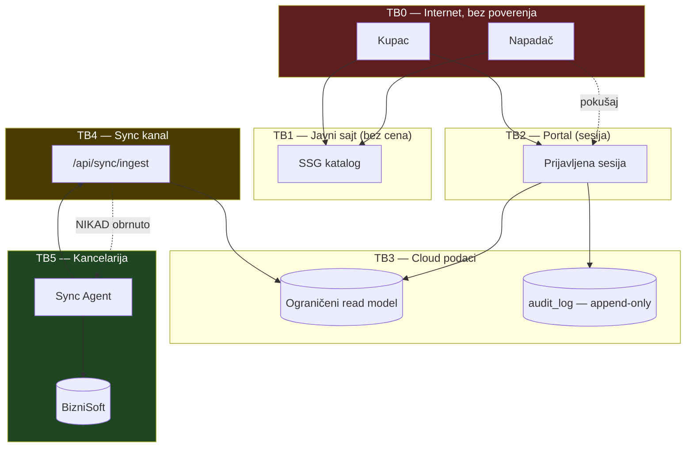

# 07 — Threat model

Za svaku pretnju: **asset · granica · napad · posledica · prevencija · detekcija · oporavak · preostali rizik**.

Stanje kontrole: 🟢 postoji (dokazano fajlom) · 🔵 planirano · 🔴 nedostaje

---

## Granice poverenja

---

## T1 — Credential stuffing

| | |
|---|---|
| **Asset** | Svi nalozi; kroz njih cene i porudžbine |
| **Granica** | TB0 → TB2 |
| **Napad** | Liste ukradenih parova e-pošta/lozinka, distribuirano sa mnogo IP adresa |
| **Posledica** | Preuzimanje naloga bez ijedne ranjivosti u kodu |

**Prevencija**
- Lockout 8/15 min **po nalogu** — `auth.ts:MAX_FAILED_ATTEMPTS` 🟢
- scrypt N=16384 + `timingSafeEqual` — `lib/auth/password.mjs` 🟢
- **Rate limiting po IP-u** 🔴 → 🔵 faza 1
- **MFA** 🔴 → 🔵 faza 1
- Minimalna dužina lozinke 10 znakova 🟢 (`hashPassword` baca ispod toga)

**Detekcija** — `audit_log` beleži `loginFailed`/`loginLocked` 🟢. Prag „N zaključavanja u sat" 🔵.
**Oporavak** — deaktivacija (`users.active`), prisilna promena lozinke, `session_version` bump 🔵.

> **Preostali rizik: visok dok nema MFA.** Lockout po nalogu ne zaustavlja napad koji proba **jednu** lozinku na **hiljadu** naloga.

---

## T2 — Krađa i fiksacija sesije

| | |
|---|---|
| **Asset** | Aktivna sesija |
| **Granica** | TB0 → TB2 |
| **Napad** | XSS (nema danas), krađa cookie-ja sa uređaja, deljeni računar |
| **Posledica** | Pristup do isteka tokena |

**Prevencija**
- JWT potpisan `AUTH_SECRET`-om; ne može se falsifikovati bez tajne 🟢
- 8h trajanje — `auth.config.ts:maxAge` 🟢
- `HttpOnly` + `Secure` + `SameSite=Lax` — NextAuth default 🟢, **ali neeksplicitno**
- ✅ **`__Host-` prefiks i host-only cookie (Faza 1A):** `lib/auth/cookie-policy.mjs`; `domain` se nikad ne postavlja, `Secure` prati isti izvod kao Auth.js pa lokalni HTTP razvoj ostaje ispravan 🟢
- **Fiksacija:** NextAuth izdaje nov token pri prijavi 🟢
- ✅ **Opoziv (Faza 1A):** `users.session_version` + provera u `lib/authz/session.ts:getPortalUser`; `revokeUserSessions` je canonical API 🟢

**Detekcija** — prijava sa nove adrese/uređaja 🔵.
**Oporavak** — bump `session_version` gasi sve sesije 🔵.

> **Preostali rizik: nizak.** Token se sada može opozvati (bump verzije obara sve sesije pri sledećem zahtevu). Ostaje da se opoziv zakači na reset lozinke i deaktivaciju — te akcije još ne postoje (Faza 1B).

---

## T3 — Enumeracija naloga

| | |
|---|---|
| **Asset** | Spisak kupaca i zaposlenih |
| **Napad** | Razlika u poruci, statusu ili vremenu odgovora |
| **Posledica** | Ciljani phishing; potvrda da je firma naš kupac |

**Prevencija**
- **Uniformna poruka** — `app/portal/actions.ts:GENERIC_ERROR` 🟢
- `authorize` vraća `null` na **svim** granama (nepostojeći, neaktivan, zaključan, pogrešna lozinka) — `auth.ts` 🟢
- ✅ **Vremenska razlika zatvorena (Faza 1A):** `lib/auth/credentials-login.mjs:resolveCredentialsLogin` izvršava **tačno jednu** proveru lozinke i za nepostojeći nalog, nad `ABSENT_USER_PASSWORD_RECORD` istih scrypt parametara. Nijedan izlaz iz odluke ne postoji pre te provere — čuva ga test 🟢
- Rate limiting po IP-u 🔴 → Faza 1B

**Detekcija** — mnogo neuspelih prijava sa različitim e-poštama sa istog IP-a 🔵.

> **Preostali rizik: nizak.** Poruka i vreme odgovora su sada isti. Ostaje rate limiting (1B), bez koga je enumeracija i dalje moguća grubom silom.

---

## T4 — Cross-customer IDOR ⚠️ najveći poslovni rizik

| | |
|---|---|
| **Asset** | Cene, porudžbine i dokumenti **drugog** kupca |
| **Granica** | TB2 iznutra |
| **Napad** | Izmena `customerId`, `orderId`, `documentId` u URL-u, telu, izvozu |
| **Posledica** | Kupac vidi cene konkurenta. **Poslovno katastrofalno** |

**Prevencija**
- **`customer_id` isključivo iz sesije** — `requireCustomerSession()` 🔵 (AD-2)
- Opseg u SQL `WHERE`, ne posle upita — presedan `lib/sales/queries.ts:loadSalesLines` → `inArray(...)` 🟢
- UUID ključevi, ne sekvence — `db/schema/*` 🟢
- Izvoz koristi isti upit kao ekran — `app/api/portal/izvoz/route.ts` 🟢
- ⚠️ `requireCustomerAccess` postoji, ali se zove **sa tačno jedne rute** (`app/portal/kupci/[id]/page.tsx:21`) 🟢 — ništa ne prisiljava buduće rute

**Detekcija** — audit svakog 403; ponovljeni 403 sa istog naloga 🔵.
**Oporavak** — deaktivacija; utvrđivanje viđenog iz audita; obaveštavanje pogođenog kupca.

> **Preostali rizik: visok dok se ne implementira i testira.**
> **Nepregovarljivo:** nijedan PR koji dodaje kupčevu rutu ne prolazi bez IDOR testa. Postojećih 35 authz testova su model kako to izgleda 🟢.

---

## T5 — Horizontalna eskalacija (kupac → drugi kupac)

Ista tehnička osnova kao T4, ali kroz **funkcije**, ne identifikatore: brza porudžbina po šifri, izvoz, preporuke, pretraga.

**Prevencija** — svaki ulaz prolazi kroz isti helper. Naročito:
- brza porudžbina po šifri **ne sme** otkriti da artikal postoji ako kupac nema cenu za njega 🔵
- pretraga vraća samo artikle iz cenovnika tog kupca 🔵
- preporuke se čitaju po `customer_id` iz sesije 🔵

> **Preostali rizik: srednji.** Lako se previdi u pretrazi i izvozu.

---

## T6 — Vertikalna eskalacija (kupac → zaposleni)

| | |
|---|---|
| **Napad** | Pozivanje internih ruta iz kupčeve sesije; podmetanje `role` |
| **Posledica** | Pristup analitici cele firme, maržama, dozvolama |

**Prevencija**
- Uloga se **ne čita iz tokena** nego iz baze pri svakom zahtevu — `auth.config.ts:session`, `user-repository.ts:loadPortalUser` 🟢
- Svaka ruta ima serversku kapiju — 25 poziva `requireCapability()`; **nijedna `/portal` ruta nije bez kapije** 🟢
- Kupci su **odvojena tabela** — ne mogu dobiti internu ulogu 🔵 (AD-2)
- ✅ **Legacy model izolovan (Faza 1A):** premešten iz živog sloja u `features/portal/LegacyAccessGuard.tsx`. Test prati graf uvoza iz `app/` i dokazuje da je nedostižan 🟢

**Detekcija** — audit 403 po kupčevom nalogu na internoj ruti 🔵.

> **Preostali rizik: nizak** — ovo je najbolje pokriveni deo postojećeg sistema.

---

## T7 — Kompromitovan komercijalista

| | |
|---|---|
| **Asset** | Svi dodeljeni kupci; predlog marže |
| **Napad** | Phishing; ili zloupotreba od samog zaposlenog |

**Prevencija**
- Vidi **samo dodeljene** — `customer_assignments` + `scope.mjs` 🟢, testirano
- Oduzimanje paketa deluje **odmah**, bez odjave 🟢
- Promena marže je **predlog** dok se ne odobri 🔵 (AD-3)
- MFA 🔴 → 🔵

**Detekcija** — audit svakog `price_change_request`; obaveštenje vlasniku za svaku **primenjenu** promenu 🔵.

> **Preostali rizik: nizak** za vidljivost, **srednji** za maržu dok workflow ne postoji.

---

## T8 — Falsifikovanje cene u pretraživaču

| | |
|---|---|
| **Napad** | Izmena `localStorage`, DevTools, direktan POST sa `price` u telu |

**Prevencija**
- **Korpa ne sadrži cenu** — `lib/cart/cart-model.mjs`; potvrđeno testom `cart-model.test.mjs:64-65` 🟢
- `parseStoredCart` odbacuje neispravne stavke i nepoznate slugove 🟢
- **Korpa nikad ne stiže na server danas** — `grep cart` nad `app/api` → 0 🟢
- Server **presnimava** cene iz M8 pri slanju 🔵 (M13)
- Zod validacija tela; nepoznata polja se odbacuju 🔵 — obrazac postoji u `app/api/portal/izvoz/route.ts` 🟢
- Ako telo uopšte sadrži polje cene → **audit + odbijanje** 🔵

**Oporavak** — nije potreban; cena nikad nije dolazila od klijenta.

> **Preostali rizik: vrlo nizak.** Najbolje pokrivena pretnja, jer je odluka „bez cene u korpi" doneta rano.

---

## T9 — Izmena između korpe i slanja (TOCTOU)

| | |
|---|---|
| **Napad** | Cena/lager se promene između prikaza i slanja |
| **Posledica** | Kupac vidi jednu cenu, dobija drugu |

**Prevencija** 🔵
- Cene se čitaju **iznova u trenutku slanja**, u istoj transakciji
- `price_snapshot` + `price_business_date` uz svaku stavku (M13)
- Razlika u odnosu na prikazano → **kupcu se prikazuje i traži potvrda**, ne šalje se tiho (vidi `05`, §6)
- Lager se **ne rezerviše** u portalu; kancelarija potvrđuje

> **Preostali rizik: nizak.** Ljudska potvrda je zaštitna mreža.

---

## T10 — Duplo slanje porudžbine

**Prevencija** 🔵 — `orders.idempotency_key` sa `uniqueIndex`; dvostruki klik vraća prvu porudžbinu. Dugme se onemogućava dok traje slanje (kozmetika, ne kapija).
**Detekcija** — dve porudžbine istog kupca sa istim stavkama u kratkom roku 🔵.

> **Preostali rizik: nizak.**

---

## T11 — Replay sync batch-a

| | |
|---|---|
| **Napad** | Presretnut batch poslat ponovo; ili zastareo batch poslat kasnije |
| **Posledica** | Vraćanje starih cena preko novih |

**Prevencija** 🔵
- `idempotency_key = sha256(dataset ‖ business_date ‖ checksum)`; isti ključ → **rezultat prvog uvoza**
- Potpisan zahtev sa `timestamp` + `nonce`, prozor **±5 min**; `nonce` se pamti
- **Monotonost `business_date` po skupu** — stariji dan se odbija
- mTLS ili HMAC

> **Preostali rizik: nizak** ako sve tri kontrole postoje. **Sama idempotency bez monotonosti datuma ne štiti od vraćanja starog dana.**

---

## T12 — Dupli import istog poslovnog dana

**Prevencija**
- `import_runs.file_hash` `uniqueIndex`; ponovni pokušaj = `preskoceno_duplikat` 🟢
- Identitet fakture `(company_id, document_kind, number, year)` `uniqueIndex` 🟢
- `db.transaction()` — `lib/import/invoiceImport.ts:114` 🟢
- Snapshot skupovi **zamenjuju**, ne dodaju 🔵
- Agent vodi lokalni dnevnik obrađenih `business_date` 🔵

> **Preostali rizik: vrlo nizak.** Već rešeno u postojećem uvozu; samo se proširuje.

---

## T13 — Maliciozan CSV

| | |
|---|---|
| **Napad** | Podmetnut fajl u izvozni folder; ogroman fajl; pogrešan broj kolona |

**Prevencija** 🔵
- Stroga validacija zaglavlja i broja kolona pre parsiranja
- Gornja granica veličine po skupu
- Odbijanje po ekstenziji **i** magičnim bajtovima (bez ZIP/EXE)
- Import **nikad ne izvršava** sadržaj
- Red-po-red rezultat u `import_rows` 🟢 — neispravan red ne ulazi u promet

> **Preostali rizik: nizak.**

---

## T14 — Formula injection ⚠️ postojeća rupa

| | |
|---|---|
| **Asset** | Računar zaposlenog koji otvori izveštaj |
| **Napad** | Naziv artikla `=cmd\|'/c calc'!A1` prođe kroz uvoz i izađe u XLSX izvozu |

**Prevencija**
- Pri uvozu — vrednost je uvek tekst 🟢 po konstrukciji
- ✅ **Pri izvozu (Faza 1A):** `lib/export/spreadsheet-safety.mjs:guardSpreadsheetValue` prefiksuje apostrofom svaku vrednost koja posle preskočene beline počinje sa `=`, `+`, `-`, `@`, ili koja počinje tabom/CR/LF. Primenjeno **pre** serijalizacije u obe tabelarne putanje 🟢
- ✅ SpreadsheetML dodatno nikad ne emituje `ss:Formula` — strukturna garancija uz sadržajnu 🟢
- ✅ Brojevi ostaju brojevi; samo nepouzdan **tekst** dobija zaštitu 🟢

**Detekcija** — provera pri uvozu označava sumnjivu vrednost kao `upozorenje` (`import_rows` postoji) 🟢.
**Oporavak** — ponovni izvoz; audit ko je preuzeo fajl — `exportGenerated` se već upisuje 🟢.

> **Preostali rizik: vrlo nizak.** Pokriveno sa 16 testova, uključujući kombinaciju separatora, navodnika i preloma reda.

---

## T15 — Path traversal

**Prevencija** 🔵 — agent čita iz **jednog** foldera bez rekurzije; ime fajla mora proći `^[A-Za-z0-9._-]{1,128}$`; razrešena putanja mora ostati unutar korena; **server ne prima putanje** (`source_path` u `import_runs` je oznaka za ljude, nikad ulaz u operaciju nad fajlom); agent nema pravo pisanja u izvorni folder (Windows ACL).

> **Preostali rizik: nizak.**

---

## T16 — Schema confusion

| | |
|---|---|
| **Napad** | Batch tvrdi da je `prices`, a sadrži `customers`; ili nova verzija sa promenjenim značenjem kolone |
| **Posledica** | Tiho pogrešan uvoz — najgora vrsta greške |

**Prevencija** 🔵
- `dataset` i `schema_version` **obavezni**; nepoznata verzija → **odbij**
- Zaglavlje mora tačno odgovarati očekivanom za taj `dataset`
- **Promena značenja polja = novo polje**, nikad tiho redefinisanje
- Provera zdravog razuma: pad broja redova > 20% → **karantin**, ne uvoz

> **Preostali rizik: nizak** uz obaveznu verziju. **Visok bez nje** — tiha greška se otkriva tek kad kupac dobije pogrešnu cenu.

---

## T17 — Dvostruko knjiženje u BizniSoft

**Prevencija** 🔵 — `order_id` je ključ prenosa; status `queued/accepted/failed`; `ack` sa **različitim** `biznisoft_document_id` za istu porudžbinu je **alarm, ne prihvatanje** (vidi `05`); **bez automatskog ponavljanja** posle `integration_failed`.
**Detekcija** — porudžbine u `queued` duže od N minuta; poređenje broja potvrđenih i prenetih 🔵.

> **Preostali rizik: srednji.** 🔴 Zavisi od P5 — ako je prenos ručni, rizik prelazi na proceduru.

---

## T18 — Kompromitovan cloud pokušava pristup kancelariji ⚠️ najstroža granica

| | |
|---|---|
| **Asset** | **Cela poslovna baza** |
| **Granica** | TB3 → TB5 |
| **Napad** | Server šalje odgovor koji agent protumači kao uputstvo |
| **Posledica** | **Potpuni kompromis firme** |

**Prevencija — sve nepregovarljivo** 🔵
1. Agent **nikada ne izvršava** ništa iz odgovora — ni komandu, ni putanju, ni URL, ni SQL
2. Odgovor prolazi **strogu shemu**; nepoznato polje se odbacuje
3. Agent nema samoažuriranje sa servera
4. Agent nema otvoren port
5. Agent ne prosleđuje odgovor drugom procesu
6. Preuzimanje porudžbina koristi **odvojen credential**, striktan JSON, bez putanja i komandi

**Detekcija** — agent loguje svaki odgovor van sheme i **zaustavlja se**.
**Oporavak** — agent se gasi; kanal se prekida; portal radi sa postojećim podacima.

> **Preostali rizik: nizak — ali samo ako se pravila poštuju doslovno.** Ovo je granica koju nijedan zahtev za udobnost ne sme pomeriti.

---

## T19 — Kompromitovan kancelarijski računar

**Prevencija** 🔵 — agent pod **namenskim nalogom bez admin prava**; read-only na izvorni folder; bez RDP-a, port forwardinga i SMB share-a ka internetu; agent ne prima ulazne veze.
**Detekcija** — izostanak sync-a; nagla promena obima; neslaganje checksum-a.
**Oporavak** — opoziv tokena; portal radi sa **poslednjim ispravnim snapshotom** dok se računar sanira. Zato snapshot mora biti verzionisan (7 dana).

> **Preostali rizik: visok — i van kontrole portala.** Portal može samo da ograniči štetu. **Ovo treba izričito reći vlasniku.**

---

## T20 — Zastareo lager

| | |
|---|---|
| **Napad** | Nije napad — **tihi otkaz**. Sync stane, portal i dalje pokazuje jučerašnji lager kao svež |
| **Posledica** | Kupac naruči nedostupno; obećanje se ne ispuni |

**Prevencija** 🔵
- **`as_of` se prikazuje uz svaku dostupnost**
- Stariji od praga → **„Podatak o dostupnosti nije aktuelan"**, ne brojka
- `nepoznato` je legitimna vrednost — obrazac `document_kind = "nepoznato"` postoji 🟢
- Portal **ne obećava** raspoloživost; potvrda dolazi od kancelarije
- Isti obrazac već primenjen: `app/portal/zalihe/page.tsx` prikazuje šta nedostaje umesto da pogađa 🟢

**Detekcija** — nadzor „poslednji uspešan sync"; upozorenje ako nema sync-a do 10:00 🔵.

> **Preostali rizik: nizak ako se prikazuje starost. Visok ako se zastareo podatak prikazuje kao svež.** Najčešća greška ovakvih sistema.

---

## T21 — Neovlašćena promena marže

**Prevencija** 🔵 — promena je **predlog** dok se ne odobri; granice ovlašćenja **u podacima** (`system_settings` postoji 🟢), ne u kodu; `approved` ≠ `applied` — važi tek posle povratnog sync-a; **obaveštenje vlasniku za svaku primenjenu promenu**.
**Detekcija** — audit sa `valueBefore`/`valueAfter` 🟢; status `reconciliation_failed` hvata odobreno-ali-neupisano.

> **Preostali rizik: nizak uz workflow, visok bez njega.**

---

## T22 — Brisanje audit loga

**Prevencija**
- **Okidači u bazi odbijaju `UPDATE` i `DELETE`** — `db/migrations/0001_audit_log_append_only.sql`, `RAISE EXCEPTION … ERRCODE 'restrict_violation'` 🟢 **najjača postojeća kontrola**
- Aplikacija nema putanju koja menja audit 🟢
- 🔴 **Oduzeti `UPDATE`/`DELETE`/`TRUNCATE` privilegije aplikativnoj ulozi** → **Faza 1B** (traži pristup bazi i odluku o ulozi, van dometa 1A) — okidač štiti od greške u kodu, **ne od naloga koji sme `DROP TRIGGER`**
- Periodičan izvoz audita van baze 🔵

**Detekcija** — praznine u `id` sekvenci; nadzor DDL operacija.

> **Preostali rizik: nizak na nivou aplikacije, srednji na nivou baze** dok se privilegije ne oduzmu.

---

## T23 — Curenje kroz logove, analitiku i error tracking

**Prevencija** 🔵
- Zabrana logovanja tela zahteva na cenovnim i porudžbinskim rutama
- Redakcija `Authorization`, `Cookie`, `INGEST_API_KEY`, `DATABASE_URL`
- Bez `console.log` poslovnih podataka u klijentskom kodu
- Bez trećestranog trackinga bez odobrenja — `COST_CONTROL.md` 🟢
- `.env*` gitignorisan; `.env.example` samo imena — `.gitignore:34-36` 🟢
- `_incoming/*.csv` gitignorisan — `.gitignore:56` 🟢

**Detekcija** — periodičan pregled loga na obrasce PIB-a (9 cifara) i iznosa.

> **Preostali rizik: nizak danas** (nema trećestranog trackinga), **raste sa svakim dodatim servisom**.

---

## T24 — Kompromitovan backup

| | |
|---|---|
| **Asset** | Kompletna kopija cloud baze — cene svih kupaca |
| **Napad** | Nezaštićen bucket; backup na deljenom disku; stari backup posle rotacije ključeva |

**Prevencija** 🔵
- Šifrovanje u mirovanju; ključ **odvojen** od backup skladišta
- Ograničen pristup, uz audit svakog preuzimanja
- **Rok čuvanja** — stari backup se briše, ne gomila
- Backup cloud baze je **read model**, ne kopija BizniSofta (AD-4)
- Obnova se proverava periodično; neproveren backup nije backup

> **Preostali rizik: srednji.** 🟡 Zavisi od izbora hostinga — vidi P14.

---

## T25 — Prekid interneta ili ugašen računar u 09:00

| | |
|---|---|
| **Napad** | Nije napad — dostupnost |
| **Posledica** | Portal radi sa jučerašnjim podacima, ili — gore — ne zna da su stari |

**Prevencija** 🔵
- Nadoknada bez duplog uvoza (lokalni dnevnik `business_date`)
- Ponovni pokušaji sa odmakom, do 18:00
- **Portal prikazuje starost podataka** — vidi T20
- Prethodni snapshot ostaje aktivan

**Detekcija** — upozorenje ako nema sync-a do 10:00 🔵.
**Oporavak** — ručno pokretanje; ručni upload i dalje radi kao rezerva 🟢.

> **Preostali rizik: nizak.** Sistem je projektovan da radi sa jučerašnjim podacima — dok to pošteno kaže.

---

## Zbirna tabela

| # | Pretnja | Kontrole | Preostali rizik | Faza |
|---|---|---|---|---|
| T1 | Credential stuffing | delimično | **visok** | 1 |
| T2 | Krađa/fiksacija sesije | **dobro (1A)** | nizak | ✅ |
| T3 | Enumeracija naloga | **dobro (1A)** | nizak | ✅ / 1B |
| **T4** | **Cross-customer IDOR** | planirano | **visok** | 2 |
| T5 | Horizontalna eskalacija | planirano | srednji | 2 |
| T6 | Vertikalna eskalacija | **dobro (1A)** | nizak | ✅ |
| T7 | Kompromitovan komercijalista | dobro | nizak/srednji | 1 |
| T8 | Cena u pretraživaču | **dobro** | vrlo nizak | — |
| T9 | TOCTOU korpa→slanje | planirano | nizak | 3 |
| T10 | Duplo slanje | planirano | nizak | 3 |
| T11 | Replay sync-a | planirano | nizak | 4 |
| T12 | Dupli import | **dobro** | vrlo nizak | — |
| T13 | Maliciozan CSV | planirano | nizak | 4 |
| T14 | Formula injection | **rešeno (1A)** | vrlo nizak | ✅ |
| T15 | Path traversal | planirano | nizak | 4 |
| T16 | Schema confusion | planirano | nizak | 4 |
| T17 | Dvostruko knjiženje | planirano | srednji | 5 |
| **T18** | **Cloud → kancelarija** | planirano | nizak uz doslovna pravila | 4 |
| **T19** | **Kompromitovana kancelarija** | van dometa portala | **visok** | — |
| T20 | Zastareo lager | planirano | nizak uz `as_of` | 4 |
| T21 | Neovlašćena marža | planirano | nizak uz workflow | 3 |
| T22 | Brisanje audita | dobro na nivou app | nizak app / srednji baza | 1B |
| T23 | Curenje kroz logove | dobro | nizak | stalno |
| T24 | Kompromitovan backup | planirano | srednji | 1 |
| T25 | Prekid / ugašen računar | planirano | nizak | 4 |

> **Stanje posle Faze 1A (2026-08-24).** Rešeno: T2 (opoziv + cookie), T3
> (timing), T6 (jedan model dozvola), T14 (formula injection). Otvoreno i dalje:
> T1 (MFA, rate limiting), T4 (IDOR — kupac ne postoji), T19, T22 na nivou baze.

### Deset najvećih rizika, po hitnosti

1. **T4 — cross-customer IDOR.** Najveća poslovna šteta. Traži automatski test po svakoj ruti.
2. **T19 — kompromitovana kancelarija.** Najveći domet, **van kontrole portala**. Reći vlasniku otvoreno.
3. **T1 — nema MFA ni rate limitinga.** Blokira produkciju.
4. **T14 — formula injection.** Jedina **postojeća** rupa u isporučenom kodu.
5. **T18 — cloud → kancelarija.** Nije izgrađeno; dizajn mora biti ispravan iz prvog pokušaja.
6. **T2 — sesija bez opoziva.** Ukraden token važi 8h.
7. **T16 — schema confusion.** Tiha greška; otkriva se tek kad kupac dobije pogrešnu cenu.
8. **T20 — zastareo lager prikazan kao svež.** Najčešća greška ovakvih sistema.
9. **T22 — audit na nivou baze.** Okidač se može ukloniti nalogom koji sme `DROP TRIGGER`.
10. **T17 — dvostruko knjiženje.** Zavisi od nepoznatog (P5).
