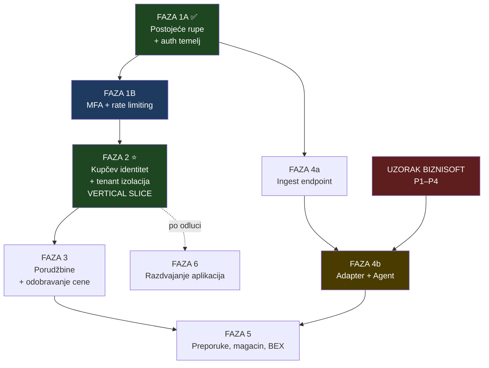

# 08 — Fazni plan implementacije

Načelo: **svaka faza je isporučiva i proverljiva sama za sebe.** Nijedna ne sme ostaviti sistem u stanju „pola radi".

---

## Šta čeka BizniSoft, a šta ne

| Može odmah — ne zavisi od izvora | Blokirano do uzorka |
|---|---|
| MFA, rate limiting, cookie postavke, CSP | **Adapter** izvor → canonical (P1–P4) |
| Sanacija formula injection | Windows **Sync Agent** (P1, P3) |
| Privilegije nad `audit_log` | Punjenje cena pravim podacima (P2) |
| Kupčev identitet i tenant izolacija | Lager i sve od njega zavisno (P3) |
| Canonical shema (`03-data-contract-draft.md`) | Povezivanje šifri sa katalogom (P4) |
| Porudžbine i tok statusa | Prenos porudžbine u BizniSoft (P5) |
| **Ingest endpoint** sa strogom shemom | BEX pošiljke (P9, P10) |
| IDOR testovi po ruti | Sezonalnost u preporukama (P7) |
| Preporuke nad postojećom shemom faktura | — |

**Posledica:** faze 0–3 i 4a idu odmah. Samo 4b je stvarna blokada.

---

## FAZA 2 — Komercijalna i identitetska osnova ✅ ZAVRŠENO

**Grana:** `feature/b2b-commercial-foundation` · **Detaljno:** `14-commercial-foundation.md`

Aditivno; nijedna postojeća tabela nije izgubila kolonu ni ograničenje,
`users.role` i dalje ima četiri interne uloge.

| # | Zadatak | Migracija | Testovi |
|---|---|---|---|
| 1 | Uklonjen mrtav paralelni RBAC i mock pricing (12 fajlova) | — | `capabilityMatrix` +2 |
| 2 | Spoljni identitet kupca (šifra partnera kao `text`) | 0008 | `externalIdentity` 15 |
| 3 | Mapiranje artikla na katalog, bez fuzzy povezivanja | 0008 | `productMapping` 16 |
| 4 | Kupčev nalog kao odvojen identitet + `requireCustomerSession()` | 0009 | `customerIsolation` 15 + 8 integracionih |
| 5 | Pravila cene, 12 klasa prvenstva, konflikt umesto izbora | 0010 | `precedence` 26 + 13 integracionih |
| 6 | Tok odobrenja, audit i obaveštenja | 0011 | `workflow` 19 + 15 integracionih |
| 7 | Portal ekrani nad stvarnim podacima | — | browser QA 18/18 |

**Nije rađeno (van dometa):** PDF parser, Windows konektor, invoice revision,
preporuke, prognoza potražnje, automatska porudžbina, obračun marže, BizniSoft
write-back, uvoz kataloga.

---

## FAZA 1A — Postojeće rupe i konsolidacija auth osnove ✅ ZAVRŠENO

**Datum:** 2026-08-24 · **Nema novih zavisnosti. Javni vizuelni sistem nije dirán.**

### Šta je urađeno

| # | Zadatak | Fajlovi | Testovi |
|---|---|---|---|
| 1 | Zaštita CSV/XLSX izvoza od formula injectiona (T14) | `lib/export/spreadsheet-safety.mjs` (nov), `lib/export/serializers.mjs` | `exportSafety.test.mjs` — 16 |
| 2 | Konstantan put provere lozinke (T3) | `lib/auth/credentials-login.mjs` (nov), `lib/auth/password.mjs`, `auth.ts` | `credentialsLogin.test.mjs` — 15 |
| 3 | Razdvajanje `orders:create` | `lib/authz/permissions.mjs`, `lib/commerce/portal-commerce.ts` | `capabilityMatrix.test.mjs` — 12 |
| 4 | Jedan aktivan model dozvola (T6) | `features/portal/LegacyAccessGuard.tsx` (nov), `components/portal/PortalPrimitives.tsx`, 3 mrtva modula | isto |
| 5 | `session_version` i opoziv sesija (T2) | `db/schema/users.ts`, `db/migrations/0003_session_version.sql` (nov), `auth.config.ts`, `lib/authz/session.ts`, `lib/authz/user-repository.ts`, `app/portal/dozvole/actions.ts` | `sessionRevocation.test.mjs` — 12 |
| 6 | Eksplicitan cookie ugovor | `lib/auth/cookie-policy.mjs` (nov), `auth.config.ts` | `cookieAndHeaders.test.mjs` — 16 |
| 7 | Bezbednosna HTTP zaglavlja | `lib/security/http-headers.mjs` (nov), `next.config.ts` | isto |

### Nove sposobnosti umesto dvoznačne

```
orders:create  →  procurement:order_create   (nabavka od dobavljača)
               →  customer_orders:create     (kupčeva porudžbina i portal korpa)
```

`customer_orders:create` **nema nijedna uloga osim `gazda`** i **nijedan paket**.
Kupčev kontekst još ne postoji, pa se pravo ne dodeljuje unapred.

### Provereno

- ✅ CSV i XLSX ne mogu protumačiti nepouzdan tekst kao formulu; brojevi ostaju brojevi
- ✅ Provera lozinke se izvršava i za nepostojeći nalog, tačno jednom
- ✅ Nabavni paket više ne otvara portal korpu
- ✅ Stari model dozvola nije dostižan iz `app/` (test prati graf uvoza)
- ✅ Stara sesija pada čim se `session_version` poveća
- ✅ Produkcijski kolačić: `__Host-`, `HttpOnly`, `Secure`, `SameSite=Lax`, `Path=/`, bez `Domain`
- ✅ Lokalni HTTP razvoj i dalje radi (bez `Secure`, bez prefiksa)
- ✅ Zaglavlja stižu na svaku rutu; build daje **1.114 statičkih strana** — SSG netaknut
- ✅ HSTS se ne šalje van produkcije

### Šta NIJE deo 1A

MFA · rate limiting · reset lozinke · recovery kodovi · kupčeva uloga ·
`customer_users` · tenant izolacija · cene · korpa na serveru · porudžbine ·
BizniSoft · BEX · razdvajanje aplikacija.

---

## FAZA 1B — Zaštita naloga ⚠️ DELIMIČNO ZAVRŠENO

**Datum:** 2026-08-24 · **Zavisnost:** `otpauth@9.5.1` (odobrena, pinovana)

### ✅ Urađeno — bezbednosno jezgro

| # | Šta | Fajlovi | Testovi |
|---|---|---|---|
| 1 | **Šifrovanje MFA tajne** AES-256-GCM, HKDF razdvajanje ključeva, verzionisanje | `lib/auth/mfa-crypto.mjs` | 13 |
| 2 | **TOTP** — RFC 6238 vektori, drift ±1, apsolutni prozor | `lib/auth/totp.mjs` | 7 |
| 3 | **Recovery kodovi** — 10 kodova, ~147 bita, HMAC otisak | `lib/auth/recovery-codes.mjs` | 8 |
| 4 | **Režimi obaveznosti** `off` / `enroll` / `enforced` | `lib/auth/mfa-enforcement.mjs` | 8 |
| 5 | **Rate limit politika** — dva nezavisna brojača, pseudonimizovani ključevi | `lib/auth/rate-limit-policy.mjs`, `rate-limit-key.mjs` | 22 |
| 6 | **Rate limit servis** — atomski upsert nad Postgresom | `lib/auth/rate-limit-service.ts` | (u istom paketu) |
| 7 | **MFA servis** — atomska zaštita od ponovne upotrebe koda i jednokratni recovery | `lib/auth/mfa-service.ts` | 17 |
| 8 | **Shema i migracija** — 4 nove tabele, aditivno | `db/schema/security.ts`, `db/migrations/0004_auth_hardening.sql` | (u istom paketu) |

**Ukupno 71 nov test.** Ceo paket: 415 testova, exit 0.

### Stanje posle 1B-CLOSURE (2026-08-24)

| # | Stavka | Stanje |
|---|---|---|
| a | Rate limit u stvarnom `authorize` toku | ✅ **urađeno** |
| b | MFA kapija pri prijavi + session assurance | ✅ **urađeno** |
| c | Ekran `/portal/bezbednost/mfa` | 🔴 **nije** |
| d | Server actions (lozinka, admin reset, deaktivacija, MFA reset) | 🔴 **nije** |
| e | Zaštita poslednjeg `gazda` naloga | 🔴 **nije** |
| f | Audit akcije | ✅ **urađeno** — 14 novih |
| g | Razdvajanje DB privilegija | 🟡 kod + runbook; **primena je spoljni blocker** |
| h | `Cache-Control: no-store` | 🔴 **nije** — nema ruta koje bi ga nosile |

Dodatno urađeno van spiska: **jednokratna dozvola za vezivanje** (`mfa_enrollment_grants`,
migracija `0005`) i **bootstrap za prvog vlasnika** (`scripts/issue-mfa-enrollment-grant.mjs`),
plus polje za drugi faktor u login formi.

> ⚠️ **MFA se još ne može aktivirati.** Prijava traži drugi faktor od onoga ko ga
> ima, ali ekran za vezivanje ne postoji — pa ga niko još ne može vezati. Do
> stavke (c) sistem radi kao pre, samo sa aktivnim ograničavanjem pokušaja.

### Rollout (kada 1B bude završena)

1. deploy sa `PORTAL_MFA_ENFORCEMENT=off`;
2. vlasnik se veže i sačuva recovery kodove;
3. ostali interni nalozi se vežu;
4. provera da recovery kod radi (potroši se jedan, pa regeneracija);
5. prelazak na `enroll`, pa posle nekoliko dana na `enforced`;
6. **tek zatim** portal sme izaći iz `MAINTENANCE_MODE`.

Prelaz između režima je **ručna** promena promenljive. Kod je nikad ne menja.

## FAZA 2 — Kupčev identitet i tenant izolacija ⭐ prvi vertical slice

> **Ovo je faza koja dokazuje da sistem sme da postoji.**

**Cilj:** jedan ručno odobren kupac vidi svoju cenu za jedan proizvod, i **nijednim putem** ne može videti tuđu.

### Deset stvari koje slice mora dokazati

| # | Dokaz | Kako se meri |
|---|---|---|
| 1 | **Zaseban dynamic portal runtime** | Portal ruta radi sa sesijom i bazom; javni sajt ostaje SSG |
| 2 | **Pravi session** | NextAuth, `__Host-` cookie, MFA, opoziv preko `session_version` |
| 3 | **Jedan ručno odobren test kupac** | `customer_users` red sa `approved_by` i `approved_at` |
| 4 | **Tenant izolacija** | `requireCustomerSession()` je jedini ulaz; `customer_id` nikad iz zahteva |
| 5 | **Jedan proizvod** | Jedan red u `product`, povezan sa `catalog_slug` |
| 6 | **Jedna efektivna cena** | Jedan red u `customer_effective_prices`, **unet ručno** |
| 7 | **Serverski preračunata korpa** | Korpa bez cena; cena se pridružuje na serveru pri prikazu |
| 8 | **Jedan order request** | `draft → submitted` sa `price_snapshot` |
| 9 | **Audit događaj** | `order.submitted` u `audit_log`, nepromenljiv |
| 10 | **Bez ikakvog pristupa lokalnom računaru** | Nula odlaznih veza ka kancelariji; cene unete ručno |

> **Ključno: cene se u ovoj fazi unose RUČNO.** Slice ne čeka BizniSoft. Tek kada ovo radi, ima smisla graditi Sync Agent.

### Scope

| # | Zadatak |
|---|---|
| 2.1 | Tabela `customer_users` (M3) + `requireCustomerSession()` |
| 2.2 | Tabela `customer_effective_prices` (M8) |
| 2.3 | Ekran za **ručan unos** cena (office) — privremeno |
| 2.4 | Kupčev layout `/portal/kupac/*` |
| 2.5 | Kupčev pregled artikala sa **njegovom** cenom |
| 2.6 | Serverska korpa (M11) — bez cena u zapisu |
| 2.7 | `orders` + `order_lines` (M12, M13), samo `draft → submitted` |
| 2.8 | Audit svake ručno unete cene i svakog slanja |
| 2.9 | **Automatski IDOR test po svakoj kupčevoj ruti** |

### Testovi
- `test:customer-authz` — `requireCustomerSession` odbija: bez sesije, sa tuđim ID-em, sa deaktiviranim kupcem, sa blokiranom firmom
- `test:customer-idor` — **po ruti**, ne uzorak
- `test:order-pricing` — cena iz tela zahteva se ignoriše i loguje

### Security acceptance criteria
- [ ] Kupac A prijavljen, menja **bilo koji** identifikator u URL-u ili telu → **403**, nikad tuđi podatak
- [ ] Isti artikal, dva kupca → **dve različite cene**
- [ ] Neprijavljen posetilac ne vidi nijednu cenu nigde
- [ ] Deaktiviran kupčev nalog gubi pristup **odmah**, bez čekanja isteka tokena
- [ ] Cena u odgovoru dolazi **isključivo** iz `customer_effective_prices`
- [ ] Poslata cena u telu → **ignorisana + audit**
- [ ] Test postoji za **svaku** kupčevu rutu
- [ ] Nula odlaznih veza ka kancelarijskoj mreži

### Rollback
Feature flag `FEATURE_CUSTOMER_PORTAL`. Isključenjem kupčev deo nestaje; interni portal netaknut.

### Nije deo faze
Preporuke · sync · BEX · magacin · workflow cena · razdvajanje aplikacija.

---

## FAZA 3 — Porudžbine, brza porudžbina, odobravanje cene

**Zavisnosti:** faza 2.

### Scope

| # | Zadatak |
|---|---|
| 3.1 | Pun tok statusa iz `05-order-state-machine.md` |
| 3.2 | Ekran office-a: pregled, ispravka, potvrda, odbijanje uz razlog |
| 3.3 | **Brza porudžbina** po šifri ili nazivu — samo iz cenovnika tog kupca (T5) |
| 3.4 | **Ponovi prethodnu porudžbinu** |
| 3.5 | `idempotency_key` po slanju |
| 3.6 | Provera razlike cene pri slanju (T9) |
| 3.7 | `price_change_requests` + workflow (M18, AD-3) |
| 3.8 | Obaveštenje vlasniku za svaku **primenjenu** promenu |
| 3.9 | Kupčev pregled porudžbina i statusa |

### Security acceptance criteria
- [ ] Dvostruki klik na „Pošalji" → **jedna** porudžbina
- [ ] Kupac ne može otvoriti tuđu porudžbinu
- [ ] Magacin **ne vidi** `draft`, `submitted`, `under_review`, `confirmed`
- [ ] Cena promenjena između korpe i slanja → **prikazuje se razlika**, ne šalje se tiho
- [ ] `approved` **ne menja** prikazanu cenu — samo `applied` posle sync-a
- [ ] Brza porudžbina **ne otkriva** postojanje artikla van cenovnika kupca
- [ ] Svaki prelaz statusa u `audit_log`

### Rollback
`FEATURE_CUSTOMER_ORDERS`. Isključenjem korpa nestaje; postojeće porudžbine ostaju vidljive office-u.

---

## FAZA 4a — Ingest endpoint (ne čeka BizniSoft)

**Zavisnosti:** faza 1.

### Scope

| # | Zadatak |
|---|---|
| 4a.1 | `/api/sync/ingest` sa ovojnicom iz `04-sync-agent-contract.md`, §3 |
| 4a.2 | Autentifikacija agenta: potpis, `nonce`, prozor ±5 min |
| 4a.3 | Idempotency + **monotonost `business_date`** |
| 4a.4 | Transakcioni snapshot import; pad → prethodni ostaje aktivan |
| 4a.5 | Rate limiting po `agent_id` |
| 4a.6 | Verzionisanje snapshota, 7 poslovnih dana |
| 4a.7 | Proširenje `/portal/importi` statusom sync-a |

### Security acceptance criteria
- [ ] Isti batch dvaput → drugi vraća **rezultat prvog**, bez ponovnog uvoza
- [ ] Batch sa **jučerašnjim** `business_date` posle današnjeg → **odbijen**
- [ ] Pogrešan checksum ili `row_count` → **odbijen ceo batch**
- [ ] Pad usred importa → **prethodni snapshot aktivan**, nikad delimično stanje
- [ ] Pad broja redova > 20% → **karantin + obaveštenje**, ne tih uvoz
- [ ] Nepoznat `schema_version` → **odbijen**, bez pokušaja tumačenja
- [ ] Odgovor sadrži **isključivo** `{status, batch_id, rows, warnings, reason_code}`

### Rollback
`FEATURE_FOLDER_CONNECTOR=0` (ime već u `.env.example` 🟢). Ručni upload **već radi** 🟢.

---

## FAZA 4b — Adapter i Windows agent 🔴 BLOKIRANO

**Zavisnosti:** faza 4a **+ odgovori na P1–P4**.

| # | Zadatak |
|---|---|
| 4b.1 | Adapter izvor → canonical |
| 4b.2 | Windows Sync Agent (09:00 `Europe/Belgrade`, stabilnost fajla, staging, checksum) |
| 4b.3 | Nadoknada bez duplog uvoza istog poslovnog dana |
| 4b.4 | Lager + prikaz `as_of` (T20) |
| 4b.5 | Povezivanje šifri sa katalogom |

### Security acceptance criteria
- [ ] Agent radi pod nalogom **bez admin prava**
- [ ] Agent ima **read-only** na izvorni folder — provereno **pokušajem pisanja**
- [ ] Ugašen računar u 09:00 → nadoknada bez duplog uvoza
- [ ] Agent **odbija i zaustavlja se** na odgovoru van sheme
- [ ] Nijedan port nije otvoren ka internetu — provereno skeniranjem
- [ ] Zastareo lager se prikazuje **kao zastareo**, ne kao svež

---

## FAZA 5 — Preporuke, magacin, BEX

**Zavisnosti:** faze 3 i 4b. Delom blokirano (P5, P7, P9, P10).

| # | Zadatak | Blokada |
|---|---|---|
| 5.1 | Recommendation worker posle uspešnog importa | — |
| 5.2 | Signali bez lagera (S1–S5, S7) | — |
| 5.3 | UI preporuka + „Dodaj sve u korpu" | — |
| 5.4 | Signali koji traže lager (S8) | P3 |
| 5.5 | Sezonalnost (S6) | P7 |
| 5.6 | **Magacinski ekran** | — |
| 5.7 | Prenos porudžbine u BizniSoft | **P5** |
| 5.8 | BEX pošiljke i adresnice | **P9, P10** |

### Security acceptance criteria
- [ ] Preporuka se računa **posle** importa, nikad u zahtevu korisnika
- [ ] Svaka nosi `reason_code`, `confidence`, `algorithm_version`
- [ ] Bez dovoljno podataka → **„Nedovoljno podataka za pouzdanu preporuku"**
- [ ] Algoritam **nikad** ne šalje porudžbinu i **nikad** sam ne puni korpu
- [ ] Cena uz preporuku je **preuzeta** efektivna cena
- [ ] **Magacinski ekran postoji pre nego što se BEX uključi** — izričit zahtev
- [ ] Prenos u BizniSoft idempotentan po `order_id`; različit `document_id` = **alarm**

---

## FAZA 6 — Razdvajanje aplikacija 🟡

**Zavisnosti:** faza 2 (ili ranije, po odluci vlasnika).

Detalji i rizici: `01-target-architecture.md`, AD-1.

**Okidač:** prvi kupčev nalog sa pravim cenama, **ili** izlazak javnog sajta iz `MAINTENANCE_MODE`, **ili** ingest endpoint u produkciji.

**Zašto ne odmah:** četiri rizika (nekomitovan rad, `middleware.ts` sa četiri posla, `lib/carsystem-data.ts` ~2.800 linija, aktivan vizuelni rad). Do tada se jeftinije dobija isto: `__Host-` cookies, CSP, host-scoping, rate limiting.

---

## Redosled i zavisnosti



Faze 1→2→3 i 1→4a idu **paralelno**. Jedina prava blokada je 4b.

---

## Test strategija

| Nivo | Alat | Pokriva |
|---|---|---|
| Čista logika | `node --test` 🟢 | Validacija, parsiranje, model korpe, cenovni snapshot |
| Autorizacija | `node --test` | **Test po ruti**, po uzoru na postojećih 35 authz testova 🟢 |
| Integracija | PGlite (`npm run db:dev` — **već postoji** 🟢) | Migracije, transakcioni import, append-only audit |
| Bezbednost | namenski paket | IDOR, formula injection, replay, idempotency, schema confusion |
| Ponašanje u pretraživaču | `playwright-core` + `scripts/verify-*.mjs` 🟢 | Postojeći obrazac iz product-variant rada |

**Ne uvoditi nov test framework.** `node --test` je dovoljan i već pokriva 136 testova u 11 paketa 🟢.

> **Nepregovarljivo:** nijedan PR koji dodaje kupčevu rutu ne prolazi bez pripadajućeg IDOR testa (T4).

---

## Rollback po fazama

| Faza | Prekidač | Šta ostaje |
|---|---|---|
| 1 | revert grane | Migracije aditivne, mogu ostati |
| 2 | `FEATURE_CUSTOMER_PORTAL=0` | Interni portal netaknut |
| 3 | `FEATURE_CUSTOMER_ORDERS=0` | Postojeće porudžbine vidljive office-u |
| 4a/4b | `FEATURE_FOLDER_CONNECTOR=0` | Ručni upload — **već radi** 🟢 |
| 5 | `FEATURE_BEX=0`, `FEATURE_RECOMMENDATIONS=0` | Ostatak portala radi |
| 6 | vraćanje na jedan deploy | DNS prebacivanje |

Načelo: **svaka faza ima prekidač koji je isključuje bez rušenja prethodnih.**

---

## Procena relativne složenosti

| Faza | Složenost | Rizik |
|---|---|---|
| 1A | srednja | ✅ završeno, aditivno |
| 1B | srednja | srednji — traži TOTP zavisnost |
| **2** | **visoka** | **visok — T4** |
| 3 | visoka | srednji |
| 4a | srednja | srednji |
| 4b | **visoka** | **visok — nepoznat izvor** |
| 5 | visoka | srednji, delom blokiran |
| 6 | srednja | srednji — vidi četiri rizika |

Faza 2 je najvažnija iako nije najveća. Tamo se odlučuje sme li sistem uopšte da postoji.
